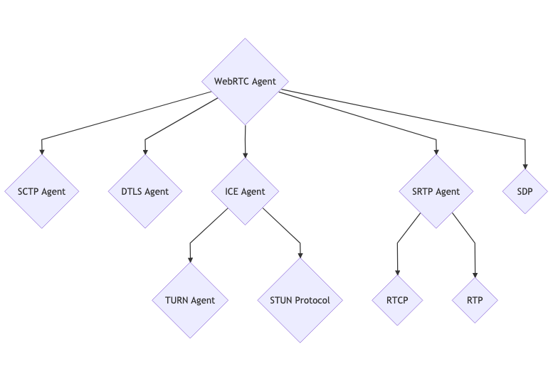

# چه چیزی، چرا و چگونه

## WebRTC چیست؟

WebRTC، که اختصاری برای Web Real-Time Communication می باشد، هم یک API و هم یک پروتکل است. پروتکل WebRTC مجموعه ای از قوانین برای دو نماینده WebRTC برای مذاکره دو طرفه و ایمن در زمان بی درنگ است. WebRTC API نیز به توسعه دهنگان اجازه می دهد که از پروتکل WebRTC استفاده کنند. WebRTC API فقط برای زبان جاوا اسکریپت است. 

یک رابطه مشابه بین HTTP و Fetch API وجود دارد. پروتکل WebRTC همانند HTTP و WebRTC API مانند Fetch API است.

پرونکل WebRTC در API ها و زبان های دیگر علاوه بر جاوا اسکریپت وجود دارد. شما می توانید سرورها و همچنین ابزار های domain-specific را پیدا کنید. همه ی این پیاده سازی ها از پروتکل WebRTC استفاده می کنند بنابراین آن ها می توانند با یکدیگر تعامل داشته باشند.

پروتکل WebRTC در IETF و در گروه کاری [rtcweb](https://datatracker.ietf.org/wg/rtcweb/documents/) نگهداری می شود.    WebRTC API  نیز در W3C تحت عنوان [webrtc](https://www.w3.org/TR/webrtc/) مستند سازی شده است.

## چرا باید WebRTC را یاد بگیرم؟

این های چیز هایی هستند که WebRTC به شما خواهد داد. این لیست جامع نیست، فقط یک نمونه از  چیز هایست که ممکن است در خلال سفر یادگیریتان قدردان آن شوید. اگر تمامی این مباحث را نمی دانید نگران نباشید، این کتاب این ها را در مسیر یادگیری به شما آموزش خواهد داد.

* یک استاندارد باز
* چندین پیاده سازی
* دسترسی در مرورگر ها
* رمزنگاری اجباری
* پیمایش NAT
* فناوری موجود تغییر کاربری داده شده
* کنترل ازدحام
* تاخیری کمتر از یک ثانیه

## پروتکل WebRTC یک مجموعه از دیگر فناوری هاست 

این یک عنوان است که به اندازه یک کتاب کامل برای توضیح دادنش وقت می برد. هرچند برای شروع ما این را به چهار بخش تقسیم کرده ایم.

* سیگنالینگ
* اتصال
* امنیت
* برقرای ارتباط

این چهار گام به ترتیب اجرا می شوند. برای شروع گام بعدی، باید گام قبلی به صورت 100% موفقیت آمیز بوده باشد.

یک حقیقت عجیب و غریب درباره WebRTC این است که هر گام در حقیقت از چندین پروتکل دیگر ساخته شده است! برای ساخت WebRTC ما خیلی از فناوری های دیگر را با هم پیوند زده ایم. از این رو، WebRTC بیشتر یک ترکیب و پیکربندی از فناوری های به خوبی درک شده است که از اویل دهه ی 2000 دور ما بوده است.

هر یک از این گام ها یک بخش مختص به خود دارند، اما بسیار مفید است که اول آن ها را در سطح بالاتر درک کنیم. به دلیل این که آن ها به یکدیگر وابسه هستند، این به شما کمک خواهد کرد که وقتی توضیح بیشتری درباره اهداف هر کدام از این گام ها به شما می دهیم درک بهتری داشته باشید.

###  سیگنالینگ: چگونه همتا ها(رایانه ها) همدیگر را در WebRTC پیدا می کنند 

زمانی که یک نماینده WebRTC می خواهد شروع می کند، هیچ ایده ای ندارد که با چه کسی قرار است برقراری ارتباط را انجام دهد و با چه چیزی قرار است با آن ها در ارتباط باشد. سیگنالیگ این مسئله را حل کرده است! سیگنالیگ استفاده می شود که تماس را راه‌اندازی کند. بنابراین دو نماینده WebRTC می توانند ارتباط را آغاز کنند.

سگتالینگ از یک پروتکل موجود به نام SDP (پروتکل توضیح نشست) استفاده می کند. SDP یک پروتکل متن ساده است. هر پیغام SDP از جفت های کلید/مقدار ساخته شده است و شامل یک لیست از "بخش های رسانه" است. SDP ی جزییات تبادل دو نماینده WebRTC مانند زیر است

* آی پی ها و درگاه های که به داوطلب ها، قابل دسترسی است.
* چه تعداد ویدیو و صدا نماینده می خواهد بفرستد.
* چه کدک ویدیو و صدا هر نماینده پشتیبانی می کند.
* مقادیری که بین اتصال استفاده می شود (`uFrag`/`uPwd`).
* مقادیری امنیتی (اثر انگشت گواهینامه امنیتی).

توجه داشته باشید که سیگنالینگ معمولا وقتی "خارج از دسترس است" اتفاق می افتد؛ که به این معناست که، برنامه ها غالبا از خود WebRTC برای تبادل پیغام های WebRTC استفاده نمی کنند. از هر معماری مناسب برای ارسال پیام می توان برای انتقال SDP ها بین همتاهای متصل استفاده کرد و بسیاری از برنامه ها از زیرساخت موجود خود (مانند نقاط پایانی REST، اتصالات WebSocket یا پراکسی های احراز هویت) برای تسهیل تبادل آسان SDP ها بین کاربران استفاده می کنند. 

### اتصالات و پیمایش NAT با استفاده از STUN/TURN

دو نماینده WebRTC اکنون جزئیات کافی برای اتصال به یکدیگر را می دانند. سپس WebRTC از یک فناوری دیگر به نام ICE استفاده می کند.

ICE (Interactive Connectivity Establishment) پروتکلی است که قدمت آن قبل از WebRTC است. ICE امکان برقراری ارتباط بین دو عامل را فراهم می کند. این عوامل می توانند در همان شبکه یا در آن سوی دنیا باشند. ICE راه حلی برای برقراری ارتباط مستقیم بدون سرور مرکزی است.

جادوی واقعی اینجا 'NAT Traversal' و STUN/TURN سرور است. این دو مفهوم تنها چیزی است که برای برقراری ارتباط با یک عامل ICE در زیرشبکه دیگر نیاز دارید. ما بعداً به بررسی عمیق این موضوعات خواهیم پرداخت.

هنگامی که ICE با موفقیت وصل شد، WebRTC سپس به ایجاد یک انتقال رمزگذاری شده می‌پردازد. این انتقال برای صدا، تصویر و داده استفاده می شود.

### ایمن سازی لایه انتقال با DTLS و SRTP

اکنون که ارتباط دو طرفه داریم (از طریق ICE) باید ارتباط امن برقرار کنیم. این کار از طریق دو پروتکل انجام می شود که قدمتی بیش از WebRTC دارند. اولین پروتکل DTLS (امنیت لایه انتقال داده) است که فقط TLS روی UDP است. TLS پروتکل رمزنگاری است که برای ایمن سازی ارتباطات از طریق HTTPS استفاده می شود. پروتکل دوم SRTP (پروتکل امن حمل و نقل بلادرنگ) است.

ابتدا WebRTC با انجام یک دست دادن(Hand Shaking) DTLS روی اتصال ایجاد شده توسط ICE متصل می شود. برخلاف HTTPS، WebRTC از مرجع مرکزی برای گواهی ها استفاده نمی کند. در عوض، WebRTC فقط ادعا می کند که گواهی مبادله شده از طریق DTLS با اثر انگشت به اشتراک گذاشته شده از طریق سیگنالینگ مطابقت دارد. این اتصال DTLS سپس برای پیام های DataChannel استفاده می شود.

سپس WebRTC از پروتکل دیگری برای انتقال صدا/تصویر به نام RTP استفاده می کند. ما بسته های RTP خود را با استفاده از SRTP ایمن می کنیم. ما جلسه SRTP خود را با استخراج کلیدها از جلسه DTLS مذاکره شده اولیه ایمن می کنیم. در فصل بعدی، به این بحث خواهیم پرداخت که چرا انتقال رسانه، پروتکل خاص خود را دارد.

حالا کار ما تمام شد! اکنون ارتباط دو طرفه و ایمن دارید. اگر یک ارتباط پایدار بین نمایندگان WebRTC خود دارید، به این همه پیچیدگی ممکن است نیاز داشته باشید. متأسفانه، دنیای واقعی محدودیت‌هایی برای از دست دادن بسته‌ها و پهنای باند دارد و بخش بعدی درباره نحوه برخورد ما با آن‌ها است.

### ارتباط با همتایان از طریق RTP و SCTP

ما اکنون دو نماینده WebRTC با ارتباطات دوطرفه ایمن داریم. بیایید ارتباط را شروع کنیم! مجدداً از دو پروتکل از قبل موجود استفاده می کنیم: RTP (پروتکل حمل و نقل بلادرنگ) و SCTP (پروتکل انتقال کنترل جریان). از RTP برای تبادل رسانه های رمزگذاری شده با SRTP و از SCTP برای ارسال و دریافت پیام های DataChannel رمزگذاری شده با DTLS استفاده می کنیم.

RTP بسیار کوچک است اما آنچه را که برای پیاده‌سازی جریان بلادرنگ نیاز است را فراهم می کند. نکته مهم این است که RTP به توسعه‌دهنده انعطاف‌پذیری می‌دهد، بنابراین آنها می‌توانند تاخیر، از دست دادن و تراکم داده را به دلخواه خود مدیریت کنند. در بخش رسانه بیشتر به این موضوع خواهیم پرداخت.

پروتکل نهایی در این بخش SCTP است. SCTP اجازه می دهد گزینه های بسیاری برای تحویل پیام ها داشته باشیم. شما می توانید به صورت اختیاری انتخاب کنید که تحویل غیرقابل اعتماد و خارج از سفارش داشته باشید، بنابراین می توانید تاخیر مورد نیاز برای سیستم های بلادرنگ را دریافت کنید.

## WebRTC، مجموعه ای از پروتکل ها
WebRTC بسیاری از مشکلات را حل می کند. در ابتدا، این ممکن است حتی بیش از حد مهندسی شده به نظر برسد. نبوغ WebRTC واقعاً وصف نکردنی است. در ابتدا تصور نمی شد که بتواند همه چیز را بهتر حل کند. در عوض، بسیاری از فن‌آوری‌های تک منظوره موجود را در بر گرفت و آنها را با هم ترکیب کرد.

این به ما این امکان را می دهد که هر قسمت را به صورت جداگانه بررسی و یاد بگیریم بدون اینکه در آنغرق شویم. یک راه خوب برای یادگیری آن این است که "WebRTC Agent" را در واقع مثل یک ارکستراتور پروتکل های مختلف تجسم کنیم.

## WebRTC (API) چگونه کار می کند

این بخش نشان می دهد که چگونه API جاوا اسکریپت به پروتکل نگاشت می شود. این یک نسخه نمایشی گسترده از WebRTC API نیست، بلکه بیشتر برای ایجاد یک مدل ذهنی از نحوه پیوند آن با یکدیگر است.
اگر با هیچکدام آشنا نیستید، اشکالی ندارد. این می تواند یک بخش سرگرم‌کننده برای یادگیری بیشتر برای شما باشد!

#### `new RTCPeerConnection`
`RTCPeerConnection` سطح بالای "نشست WebRTC"  است. این شامل تمام پروتکل های ذکر شده در بالا است. زیرسیستم ها همه تخصیص داده شده اند اما هنوز هیچ اتفاقی نمی افتد.

#### `addTrack`

`addTrack` یک جریان RTP جدید ایجاد می کند. یک منبع همگام سازی تصادفی (SSRC) برای این جریان ایجاد می شود. سپس این جریان در قسمت توضیحات جلسه ایجاد شده توسط `createOffer` در یک بخش رسانه قرار خواهد گرفت. هر تماس با `addTrack` یک بخش رسانه و SSRC جدید ایجاد می کند.

بلافاصله پس از ایجاد یک جلسه SRTP، این بسته های رسانه ای پس از رمزگذاری با استفاده از SRTP از طریق ICE ارسال می شوند.

#### `createDataChannel`

`createDataChannel` در صورت عدم وجود ارتباط SCTP، یک جریان SCTP جدید ایجاد می کند. به طور پیش‌فرض، SCTP فعال نیست، اما تنها زمانی شروع می‌شود که یک طرف درخواست کانال داده را داشته باشد.

بلافاصله پس از ایجاد یک جلسه DTLS، انجمن SCTP شروع به ارسال بسته ها از طریق ICE و رمزگذاری شده با DTLS می کند.

#### `createOffer`

`createOffer` یک Session Description از وضعیت محلی ایجاد می کند تا با همتای راه دور به اشتراک گذاشته شود.

عمل فراخوانی `createOffer` چیزی را برای همتای محلی تغییر نمی‌دهد.

#### `setLocalDescription`

`setLocalDescription` هر گونه تغییر درخواستی را انجام می دهد. `addTrack`، `createDataChannel` و تماس‌های مشابه همگی تا برقراری این تماس، به تعویق می افتد. `setLocalDescription` با مقدار ایجاد شده توسط `createOffer` فراخوانی می شود.

معمولاً پس از این تماس، پیشنهاد را برای همتای راه دور ارسال می‌کنید و آنها با آن `setRemoteDescription` را فراخوانی می‌کنند.

#### `setRemoteDescription`

`setRemoteDescription` نحوه اطلاع رسانی به نماینده محلی در مورد وضعیت داوطلب ها راه دور است. به این ترتیب عمل 'سیگنالینگ' با API جاوا اسکریپت انجام می شود.

وقتی `setRemoteDescription` از هر دو طرف فراخوانی شد، نمایندگان WebRTC اکنون اطلاعات کافی برای شروع ارتباط Peer-To-Peer (P2P) را دارند!

#### `addIceCandidate`

`addIceCandidate` به یک نماینده WebRTC اجازه می‌دهد تا هر زمان که بخواهد، نامزدهای ICE  راه دور بیشتری را اضافه کند. این ICE Candidate ،API را مستقیماً به زیرسیستم ICE می فرستد و تأثیر بیشتر دیگری بر اتصال WebRTC  ندارد.

#### `ontrack`

`ontrack` یک تابع بازگشتی است که زمانی که بسته RTP از همتای راه دور دریافت می‌شود، فعال می‌شود. بسته‌های دریافتی باید در توضیحات جلسه که به `setRemoteDescription` ارسال شده بود، تعیین شده باشند.

WebRTC از SSRC استفاده می‌کند و توابع بازگشتی `MediaStream` و `MediaStreamTrack` مرتبط این جزئیات فراخوانی می‌کند.

#### `oniceconnectionstatechange`

`oniceconnectionstatechange` یک تابع بازگشتی است که وضعیت عامل ICE را فراخوانی می‌کند. هنگامی که شما به شبکه متصل هستید یا زمانی که اتصال شما قطع می شود به این ترتیب به شما اطلاع داده می شود.

#### `onconnectionstatechange`

`onconnectionstatechange` ترکیبی از ICE Agent و وضعیت عامل DTLS است. این می‌تواند شما را زمانی که ICE و DTLS هر دو با موفقیت تکمیل شدند مطلع کند.

