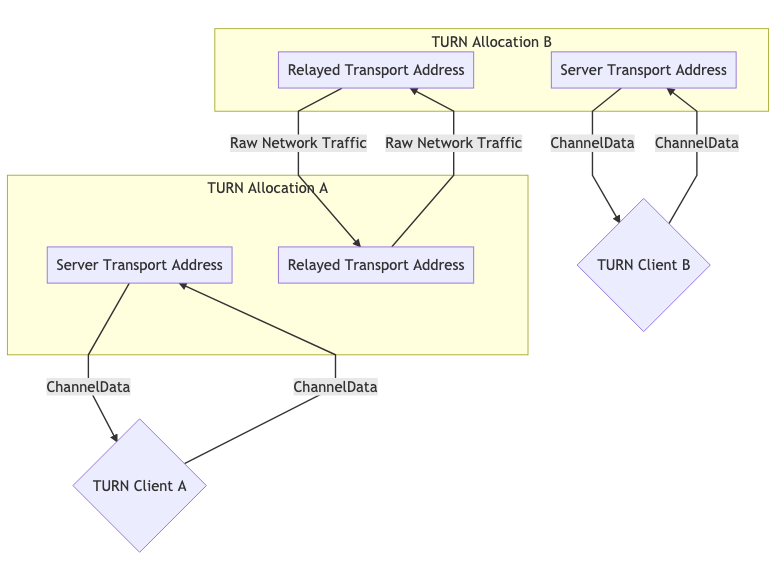

<div dir="rtl">

# چرا WebRTC برای اتصال به یک زیرسیستم اختصاصی نیاز دارد؟

اکثر برنامه های کاربردی که امروزه نوشته می شوند، اتصالات مشتری/سرور هستند. اتصال مشتری/سرور مستلزم آن است که سرور یک آدرس انتقال شناخته شده پایدار داشته باشد. یک کلاینت با یک سرور تماس می گیرد و سرور پاسخ می دهد.

WebRTC از مدل کلاینت/سرور استفاده نمی کند، بلکه اتصالات همتا به همتا (P2P) را ایجاد می کند. در یک اتصال P2P وظیفه ایجاد یک اتصال به طور مساوی بین هر دو همتا توزیع می شود. این به این دلیل است که یک آدرس انتقال (IP و پورت) در WebRTC قابل فرض نیست و حتی ممکن است در طول جلسه تغییر کند. WebRTC تمام اطلاعاتی را که می تواند جمع آوری می کند و برای دستیابی به ارتباط دو طرفه بین دو نماینده WebRTC تمام تلاش خود را خواهد کرد.

با این حال، ایجاد اتصال همتا به همتا ممکن است دشوار باشد. این عوامل می توانند در شبکه های مختلف بدون اتصال مستقیم باشند. در شرایطی که اتصال مستقیم وجود دارد، همچنان می توانید مشکلات دیگری نیز داشته باشید. در برخی موارد، کلاینت های شما از پروتکل‌های شبکه یکسانی صحبت نمی‌کنند (UDP <-> TCP) یا ممکن است از نسخه‌های IP مختلف (IPv4 <-> IPv6) استفاده کنند.

علی‌رغم این مشکلات در راه‌اندازی اتصال P2P، به دلیل ویژگی‌های زیر که WebRTC ارائه می‌کند، مزایایی نسبت به فناوری سنتی Client/Server دارید.

### کاهش هزینه های پهنای باند

از آنجایی که ارتباطات رسانه ای مستقیماً بین همتایان انجام می شود، لازم نیست هزینه ای برای آن بپردازید، یا سرور جداگانه ای برای انتقال رسانه میزبانی کنید.

### تاخیر کمتر

ارتباط زمانی که مستقیم باشد سریعتر است! وقتی کاربر مجبور است همه چیز را از طریق سرور شما اجرا کند، انتقال را کندتر می کند.

### ارتباط امن E2E

ارتباط مستقیم امن تر است. از آنجایی که کاربران داده ها را از طریق سرور شما مسیریابی نمی کنند، حتی نیازی نیست که آن ها به شما اعتماد کنند که داده ها را رمزگشایی می کنید یا نه.

## چگونه کار می کند؟

فرآیندی که در بالا توضیح داده شد، ایجاد ارتباط تعاملی ([ICE](https://tools.ietf.org/html/rfc8445)) نامیده می شود. پروتکل دیگری که پیش از WebRTC وجود داشته است.

ICE پروتکلی است که سعی می کند بهترین راه برای برقراری ارتباط بین دو عامل ICE را پیدا کند. هر عامل ICE راه‌هایی را که قابل دسترسی است منتشر می‌کند، اینها به عنوان نامزد شناخته می‌شوند. یک نامزد اساساً یک آدرس حمل و نقل نماینده است که معتقد است همتایان دیگر می توانند به آن دسترسی پیدا کنند. سپس ICE بهترین جفت کاندیداها را تعیین می کند.

فرآیند ICE حقیقی در ادامه این فصل با جزئیات بیشتر توضیح داده می شود. این بخش برای درک اینکه چرا ICE وجود دارد و درک اینکه بر چه رفتارهای شبکه ای غلبه می کنیم مفید است.

## محدودیت های دنیای واقعی شبکه
ICE همه چیز در مورد غلبه بر محدودیت های شبکه های دنیای حقیقی است. قبل از اینکه راه حل را بررسی کنیم، اجازه دهید در مورد مشکلات واقعی صحبت کنیم.

### در یک شبکه نیست
در بیشتر مواقع عامل دیگر WebRTC حتی در همان شبکه نیست. و به اینگونه است که یک تماس معمولی معمولاً بین دو نماینده WebRTC در شبکه های مختلف بدون اتصال مستقیم است.

در زیر نمودار دو شبکه مجزا که از طریق اینترنت متصل شده‌اند، مشاهده می کنید. در هر شبکه شما دو هاست دارید.


برای هاست های موجود در یک شبکه اتصال بسیار آسان است. ارتباط بین `192.168.0.1 -> 192.168.0.2` آسان است! این دو هاست می توانند بدون هیچ کمک خارجی به یکدیگر متصل شوند.

با این حال، میزبانی که از `روتر B` استفاده می‌کند، راهی برای دسترسی مستقیم به چیزی در پشت `روتر A` است را ندارد. چگونه تفاوت بین `192.168.0.1` در پشت `روتر A` و همان IP پشت `روتر B` را بیان می کنید؟ آی پی های خصوصی هستند! میزبانی که از `روتر B` استفاده می‌کند، می‌تواند ترافیک را مستقیماً به `روتر A` ارسال کند، اما درخواست در آنجا به پایان می‌رسد. `روتر A` چگونه می داند که باید پیام را به کدام میزبان ارسال کند؟

### محدودیت های پروتکل
برخی از شبکه ها به هیچ وجه اجازه ترافیک UDP را نمی دهند یا حتی ممکن است TCP را هم مجاز ندانند. برخی از شبکه ها ممکن است دارای MTU (واحد انتقال حداکثر) بسیار پایین باشند. متغیرهای زیادی وجود دارد که مدیران شبکه می توانند آنها را تغییر دهند که می تواند ارتباط را دشوار کند.

### قوانین فایروال/IDS
مشکل دیگر "بازرسی عمیق بسته" و فیلترهای هوشمند دیگر است. برخی از مدیران شبکه، نرم افزاری را اجرا می کنند که سعی می کند هر بسته را پردازش کند. بسیاری از اوقات این نرم افزار WebRTC را نمی فهمد، بنابراین آن را مسدود می کند زیرا نمی داند چه کاری انجام دهد، به عنوان مثال. در نظر گرفتن بسته های WebRTC به عنوان بسته های UDP مشکوک در یک پورت دلخواه که در لیست سفید نیست.

##نگاشت NAT
نگاشت NAT (ترجمه آدرس شبکه) جادویی است که اتصال WebRTC را ممکن می کند. به این صورت است که WebRTC به دو همتا در زیرشبکه های کاملاً متفاوت اجازه می دهد تا با هم ارتباط برقرار کنند و مشکل "در شبکه یکسانی" که در بالا گفته شد را برطرف می کند. در حالی که این چالش‌های جدیدی را نیز ایجاد می‌کند، اجازه دهید در وهله اول نحوه عملکرد نگاشت NAT را توضیح دهیم.

این از رله، پروکسی یا سرور استفاده نمی کند. باز هم "عامل 1" و "عامل 2" را داریم و آنها در شبکه های مختلف هستند. با این حال، ترافیک به طور کامل در جریان است. که به این شکل است:


برای ایجاد این ارتباط، یک نگاشت NAT ایجاد می کنید. عامل 1 از پورت 7000 برای ایجاد یک اتصال WebRTC با عامل 2 استفاده می کند. این یک اتصال از `192.168.0.1:7000` به`5.0.0.1:7000` ایجاد می کند. سپس به عامل 2 اجازه می دهد تا با ارسال بسته ها به `5.0.0.1:7000` به عامل 1 برسد. ایجاد یک نگاشت NAT مانند این است که یک نسخه خودکار از انجام انتقال پورت در روتر شما باشد.

نقطه ضعف نگاشت NAT این است که یک شکل واحد از نقشه برداری وجود ندارد (مثلاً ارسال پورت استاتیک)، و رفتار بین شبکه ها ناسازگار است. ISP ها و سازندگان سخت افزار ممکن است این کار را به روش های مختلف انجام دهند. در برخی موارد، مدیران شبکه ممکن است حتی آن را غیرفعال کنند.

خبر خوب این است که طیف کامل رفتارها قابل درک و مشاهده است، بنابراین یک عامل ICE می تواند تأیید کند که نگاشت NAT و ویژگی های نگاشت را ایجاد کرده است.

مستندی که این رفتارها را توصیف می کند در  [RFC 4787](https://tools.ietf.org/html/rfc4787) است.

### ایجاد نگاشت
ایجاد یک نگاشت ساده ترین بخش است. هنگامی که یک بسته را به آدرسی خارج از شبکه خود ارسال می کنید، یک نگاشت ایجاد می شود! نگاشت NAT فقط یک IP عمومی و پورت موقت است که توسط NAT شما اختصاص داده می شود. پیام خروجی بازنویسی می شود تا آدرس منبع آن به آدرس جدید نگاشت شده، بدهد. اگر پیامی به نگاشت ارسال شود، به طور خودکار به میزبان درون NAT که آن را ایجاد کرده است، هدایت می‌شود. جزئیات در مورد نگاشت پیچیده است.

### رفتارهای ایجاد نگاشت
ایجاد نگاشت به سه دسته مختلف تقسیم می شود:

#### نگاشت Endpoint-Independent
یک نگاشت برای هر فرستنده در داخل NAT ایجاد می شود. اگر دو بسته را به دو آدرس راه دور مختلف ارسال کنید، نقشه NAT مجددا استفاده می شود. هر دو هاست راه دور یک منبع IP و پورت یکسانی را می بینند. اگر میزبان های راه دور پاسخ دهند، به همان شنونده محلی بازگردانده می شود.

این بهترین سناریو است. برای انجام یک تماس، حداقل یک طرف باید از این روش پشتیبانی کند.

#### نگاشت وابسته به آدرس
هر بار که یک بسته را به آدرس جدیدی ارسال می کنید، یک نگاشت جدید ایجاد می شود. اگر دو بسته را به هاست های مختلف ارسال کنید، دو نگاشت ایجاد می شود. اگر دو بسته را به یک میزبان راه دور اما پورت های مقصد متفاوت ارسال کنید، نقشه جدیدی ایجاد نخواهد شد.

#### نگاشت وابسته به آدرس و پورت
اگر IP یا پورت راه دور متفاوت باشد، نقشه جدیدی ایجاد می شود. اگر دو بسته را به یک میزبان راه دور، اما پورت های مقصد متفاوت ارسال کنید، یک نقشه جدید ایجاد می شود.

### رفتارهای فیلترینگ نگاشت
فیلترینگ نگاشت قوانینی است که در مورد افرادی است که مجاز به استفاده از نگاشت هستند. آنها به سه طبقه بندی مشابه تقسیم می شوند:

#### فیلتر مستقل از نقطه پایانی
هر کسی می تواند از نگاشت استفاده کند. شما می توانید نگاشت را با چندین همتای دیگر به اشتراک بگذارید، و همه آنها می توانند ترافیک را به آن ارسال کنند.

#### فیلتر وابسته به آدرس
فقط میزبانی که نگاشت برای آن ایجاد شده است می تواند از نگاشت استفاده کند. اگر بسته ای را به میزبان `A` ارسال کنید، می تواند با هر تعداد بسته که بخواهد پاسخ دهد. اگر میزبان `B` سعی کند بسته ای را به آن نگاشت ارسال کند، نادیده گرفته می شود.

#### فیلتر وابسته به آدرس و پورت
فقط میزبان و پورتی که نقشه برداری برای آنها ایجاد شده است می توانند از آن نگاشت استفاده کنند. اگر بسته ای را به میزبان `A:5000` بفرستید، می تواند با هر تعداد بسته که بخواهد پاسخ دهد. اگر میزبان `A:5001` بخواهد بسته ای را به آن نگاشت ارسال کند، نادیده گرفته می شود.

### به روز رسانی نگاشت
توصیه می شود در صورت عدم استفاده از نگاشت به مدت 5 دقیقه،  خود به خوداز بین برود. این کاملا به ISP یا سازنده سخت افزار بستگی دارد.

## STUN
STUN (Session Traversal Utilities for NAT) پروتکلی است که فقط برای کار با NAT ایجاد شده است. این یکی دیگر از فناوری‌هایی است که پیش از WebRTC (و ICE!) قدمت دارد. این پروتکل در [RFC 8489](https://tools.ietf.org/html/rfc8489) تعریف شده است، که همچنین ساختار بسته STUN را تعریف می کند. پروتکل STUN نیز توسط ICE/TURN استفاده می شود.

STUN مفید است زیرا امکان ایجاد برنامه‌ای NAT Mappings را فراهم می‌کند. قبل از STUN، ما می توانستیم یک نقشه NAT ایجاد کنیم، اما نمی دانستیم IP و پورت آن چیست! STUN نه تنها به شما توانایی ایجاد یک نقشه را می دهد، بلکه جزئیات را نیز در اختیار شما قرار می دهد تا بتوانید آنها را با دیگران به اشتراک بگذارید، بنابراین آنها می توانند از طریق نگاشتی که ایجاد کرده اید، ترافیک را برای شما ارسال کنند.

بیایید با توضیح اولیه STUN شروع کنیم. بعداً، استفاده از TURN و ICE را گسترش خواهیم داد. در حال حاضر، ما فقط می خواهیم جریان درخواست/پاسخ را برای ایجاد یک نگاشت توصیف کنیم. سپس در مورد چگونگی به اشتراک گذاشتن جزئیات آن با دیگران صحبت خواهیم کرد. این فرآیند زمانی اتفاق می‌افتد که در URLهای ICE خود برای یک WebRTC PeerConnection یک سرور `stun:` داشته باشید. به طور خلاصه، STUN به یک نقطه پایانی در پشت NAT کمک می کند تا با درخواست از یک سرور STUN خارج از NAT برای گزارش آنچه مشاهده می کند، بفهمد که چه نگاشتی ایجاد شده است.

### ساختار پروتکل
هر بسته STUN دارای ساختار زیر است:

```
 0                   1                   2                   3
 0 1 2 3 4 5 6 7 8 9 0 1 2 3 4 5 6 7 8 9 0 1 2 3 4 5 6 7 8 9 0 1
+-+-+-+-+-+-+-+-+-+-+-+-+-+-+-+-+-+-+-+-+-+-+-+-+-+-+-+-+-+-+-+-+
|0 0|     STUN Message Type     |         Message Length        |
+-+-+-+-+-+-+-+-+-+-+-+-+-+-+-+-+-+-+-+-+-+-+-+-+-+-+-+-+-+-+-+-+
|                         Magic Cookie                          |
+-+-+-+-+-+-+-+-+-+-+-+-+-+-+-+-+-+-+-+-+-+-+-+-+-+-+-+-+-+-+-+-+
|                                                               |
|                     Transaction ID (96 bits)                  |
|                                                               |
+-+-+-+-+-+-+-+-+-+-+-+-+-+-+-+-+-+-+-+-+-+-+-+-+-+-+-+-+-+-+-+-+
|                             Data                              |
+-+-+-+-+-+-+-+-+-+-+-+-+-+-+-+-+-+-+-+-+-+-+-+-+-+-+-+-+-+-+-+-+
```

#### نوع پیام STUN
هر بسته STUN یک نوع دارد. در حال حاضر، ما فقط به موارد زیر اهمیت می دهیم:

* درخواست الزام آور - `0x0001`
* پاسخ الزام آور - `0x0101`

برای ایجاد یک نگاشت NAT، یک `Binding Request` ارائه می کنیم. سپس سرور با  `Binding Response` پاسخ می دهد.

#### طول پیام
طول بخش `داده` به این شکل است. این بخش حاوی داده های دلخواه است که با `نوع پیام` تعریف شده است.

#### کوکی جادویی
مقدار ثابت `0x2112A442` به ترتیب بایت شبکه، به تشخیص ترافیک STUN از سایر پروتکل‌ها کمک می‌کند.

#### شناسه تراکنش
این یک شناسه 96 بیتی که به طور منحصر به فرد درخواست/پاسخ را شناسایی می کند می باشد. این به شما کمک می کند تا درخواست ها و پاسخ های خود را جفت کنید.

#### داده ها
داده ها حاوی لیستی از ویژگی های STUN هستند. یک ویژگی STUN ساختار زیر را دارد:

```
0                   1                   2                   3
 0 1 2 3 4 5 6 7 8 9 0 1 2 3 4 5 6 7 8 9 0 1 2 3 4 5 6 7 8 9 0 1
+-+-+-+-+-+-+-+-+-+-+-+-+-+-+-+-+-+-+-+-+-+-+-+-+-+-+-+-+-+-+-+-+
|         Type                  |            Length             |
+-+-+-+-+-+-+-+-+-+-+-+-+-+-+-+-+-+-+-+-+-+-+-+-+-+-+-+-+-+-+-+-+
|                         Value (variable)                ....
+-+-+-+-+-+-+-+-+-+-+-+-+-+-+-+-+-+-+-+-+-+-+-+-+-+-+-+-+-+-+-+-+
 ```

"درخواست الزام آور STUN" از هیچ ویژگی استفاده نمی کند. این به این معنی است که `درخواست الزام آور STUN` فقط شامل سرصفحه است.

 مفهوم `STUN Binding Request` از یک "XOR-MAPPED-ADDRESS (0x0020)" استفاده می کند. این ویژگی شامل یک IP و پورت است. این آی پی و پورت نگاشت NAT است که ایجاد شده است!

### یک نگاشت NAT ایجاد کنید
ایجاد یک نگاشت NAT با استفاده از STUN فقط به ارسال یک درخواست کننده نیاز دارد! شما یک `STUN Binding Request` را به سرور STUN ارسال می کنید. سپس سرور STUN با `STUN Binding Response` پاسخ می دهد.
این `STUN Binding Request` حاوی `آدرس نگاشت شده` خواهد بود. `آدرس نگاشت شده` روشی است که سرور STUN شما را می‌بیند و `نگاشت NAT` شما است.
`آدرس نگاشت شده` همان چیزی است که اگر بخواهید شخصی بسته‌هایی را برای شما ارسال کند، به اشتراک می‌گذارید.

 همچنین دیگران `آدرس نگاشت شده شده` را `IP عمومی` یا `کاندیدای بازتابی سرور` شما می‌خوانند.

### تعیین نوع NAT
متأسفانه، `آدرس نگاشت شده` ممکن است در همه موارد مفید نباشد. اگر `وابسته به آدرس` باشد، فقط سرور STUN می‌تواند ترافیک را برای شما ارسال کند. اگر آن را به اشتراک گذاشتید و همتای دیگری سعی کرد در آن پیام ارسال کند، حذف خواهند شد. این باعث می شود که برای برقراری ارتباط با دیگران بی فایده باشد. اگر سرور STUN بتواند بسته‌ها را برای شما به همتا ارسال کند، ممکن است در واقع مورد `وابسته به آدرس` قابل حل باشد! این ما را به راه حل با استفاده از TURN هدایت می کند.

[RFC 5780](https://tools.ietf.org/html/rfc5780) روشی را برای اجرای تست تعیین نوع NAT شما تعریف می کند. این مفید است زیرا شما از قبل می دانید که آیا اتصال مستقیم امکان پذیر است یا خیر.

##TURN
TURN (پیمایی با استفاده از رله‌ها در اطراف NAT) در [RFC 8656](https://tools.ietf.org/html/rfc8656) تعریف شده است، زمانی که اتصال مستقیم امکان‌پذیر نیست. ممکن است به این دلیل باشد که شما دو نوع NAT دارید که ناسازگار هستند، یا شاید نمی‌توانید با یک پروتکل را صحبت کنید! TURN همچنین می تواند برای اهداف حفظ حریم خصوصی استفاده شود. با اجرای تمام ارتباطات خود از طریق TURN، آدرس واقعی کلاینت را مبهم می کنید.

TURN از یک سرور اختصاصی استفاده می کند. این سرور به عنوان یک پروکسی برای یک کلاینت عمل می کند. کلاینت به یک سرور TURN متصل می شود و `Allocation` ایجاد می شود. با ایجاد یک تخصیص، یک کلاینت یک IP/پورت/پروتکل موقت دریافت می کند که می تواند برای ارسال ترافیک به کلاینت استفاده شود. این شنونده جدید به `آدرس حمل و نقل رله شده` معروف است. آن را به عنوان یک آدرس فوروارد در نظر بگیرید، این را می دهید تا دیگران بتوانند ترافیک را از طریق TURN برای شما ارسال کنند! برای هر همتای که `آدرس حمل و نقل رله` را به آن می دهید، باید `مجوز` جدیدی ایجاد کنید تا امکان ارتباط با شما فراهم شود.

وقتی ترافیک خروجی را از طریق TURN ارسال می کنید، از طریق `آدرس حمل و نقل رله شده` ارسال می شود. وقتی یک همتای راه دور ترافیک دریافت می کند، آن را از سرور TURN دریافت می کند.

### چرخه حیات
موارد زیر تمام کارهایی است که وقتی یک کلاینت می خواهد یک تخصیص TURN ایجاد کند باید انجام دهد. برقراری ارتباط با فردی که از TURN استفاده می کند نیازی به تغییر ندارد. همتای دیگر یک IP و پورت دریافت می کند و مانند هر میزبان دیگری با آن ارتباط برقرار می کند.

#### تخصیص
تخصیص ها در هسته TURN هستند. `تخصیص` اساساً یک `جلسه TURN` است. برای ایجاد یک تخصیص TURN، شما با `آدرس حمل و نقل سرور` TURN (معمولاً پورت `3478`) ارتباط برقرار می کنید.

هنگام ایجاد یک تخصیص، باید موارد زیر را ارائه دهید:
* نام کاربری / رمز عبور - ایجاد تخصیص TURN نیاز به احراز هویت دارد.
* تخصیص transport - پروتکل انتقال بین سرور ("آدرس حمل و نقل رله") و همتایان، می تواند UDP یا TCP باشد.
* یک پورت زوج - می‌توانید پورت‌های متوالی را برای تخصیص‌های متعدد درخواست کنید، که برای WebRTC مرتبط نیستند.

اگر درخواست با سرور TURN موفقیت آمیز بود، پاسخی با ویژگی های STUN زیر در بخش داده دریافت می کنید:
* `XOR-MAPPED-ADDRESS` - `آدرس نگاشت شده` `TURN Client`. وقتی که شخصی داده ها را به `آدرس حمل و نقل رله شده` می فرستد، همان جایی که داده به آن ارسال می شود.
* `RELEYED-ADDRESS` - این آدرسی است که شما به مشتریان دیگر می دهید. اگر شخصی بسته ای را به این آدرس بفرستد، به کلاینت TURN رله می شود.
* `LIFETIME` - طول عمر تخصیص TURN چقدر باشد. می‌توانید با ارسال درخواست `Refresh` طول عمر را افزایش دهید.

#### مجوزها
یک میزبان راه دور نمی‌تواند به `آدرس حمل و نقل رله شده` شما داده ارسال کند تا زمانی که مجوزی برای آنها ایجاد شود. وقتی مجوز ایجاد می کنید، به سرور TURN می گویید که این IP و پورت مجاز به ارسال ترافیک ورودی هستند.

میزبان راه دور باید IP و پورت را همانطور که در سرور TURN ظاهر می شود به شما بدهد. این بدان معنی است که باید یک `STUN Binding Request` به سرور TURN ارسال کنید. یک مورد خطای رایج این است که یک میزبان راه دور یک `درخواست اتصال STUN` را به سرور دیگری ارسال می کند. سپس از شما می خواهند که برای این IP مجوز ایجاد کنید.

فرض کنید می خواهید یک مجوز برای یک میزبان در پشت `نگاشت وابسته به آدرس` ایجاد کنید. اگر `آدرس نگاشت شده` را در سرور TURN دیگری ایجاد کنید، تمام ترافیک ورودی حذف می‌شود. هر بار که آنها با یک کلاینت جدید ارتباط برقرار می کنند، نگاشت جدیدی ایجاد می کند. مجوزها در صورت بازنگری نشدن پس از 5 دقیقه منقضی می شوند.

#### SendIndication/ChannelData
این دو پیام برای TURN Client برای ارسال پیام به یک همتای راه دور است.

SendIndication یک پیام مستقل است. در داخل آن داده‌ها وشخصی است که می‌خواهید برای او ارسال کنید. اگر پیام‌های زیادی به یک همتای راه دور ارسال می‌کنید، وقت تلف کردن است. اگر 1000 پیام ارسال کنید، آدرس IP آنها را 1000 بار تکرار خواهید کرد!

ChannelData به شما امکان می دهد داده ارسال کنید، اما یک آدرس IP را تکرار نکنید. شما یک کانال با IP و پورت ایجاد می کنید. سپس با ChannelId ارسال می‌کنید و IP و پورت در سمت سرور پر می‌شوند. اگر می خواهید پیام های زیادی ارسال می کنید این گزینه بهتر است.

#### تازه سازی
تخصیص ها به طور خودکار خود را از بین می برند. TURN Client باید آنها را زودتر از `LIFETIME` داده شده هنگام ایجاد تخصیص، بازخوانی کند.

### TURN استفاده
استفاده از TURN به دو صورت امکان پذیر است. معمولاً، یکی از همتایان شما به عنوان `کارخواه TURN` عمل می کند و طرف دیگر مستقیماً با شما ارتباط برقرار می کند. در برخی موارد ممکن است هر دو طرف استفاده از TURN داشته باشند، برای مثال به این دلیل که هر دو کلاینت در شبکه هایی هستند که UDP را مسدود می کنند و بنابراین اتصال به سرورهای TURN مربوطه از طریق TCP انجام می شود.

این نمودارها به شما کمک می کند تا نشان دهید که چگونه به نظر می رسد.

#### تخصیص یک نوبت برای ارتباطات


#### تخصیص دو نوبتی برای ارتباطات



##ICE
ICE (Interactive Connectivity Establishment) نحوه اتصال WebRTC دو عامل است. این فناوری که در [RFC 8445](https://tools.ietf.org/html/rfc8445) تعریف شده است، یکی دیگر از فناوری‌های پیش از WebRTC است! ICE یک پروتکل برای ایجاد اتصال است. تمام مسیرهای ممکن بین دو همتا را تعیین می‌کند و سپس تضمین می‌کند که در ارتباط باشید.

این مسیرها با نام `Candidate Pairs` شناخته می‌شوند که جفتی از آدرس Transport محلی و راه دور است. اینجاست که STUN و TURN با ICE وارد بازی می شوند. این آدرس‌ها می‌توانند آدرس IP محلی شما به‌علاوه یک پورت، `نگاشت NAT` یا `آدرس انتقالی` باشند. هر طرف تمام آدرس‌هایی را که می‌خواهند استفاده کنند جمع‌آوری می‌کنند، آنها را مبادله می‌کنند و سپس تلاش می‌کنند تا متصل شوند!

دو عامل ICE با استفاده از بسته های پینگ ICE (یا به طور رسمی بررسی های اتصال نامیده می شوند) برای برقراری ارتباط با یکدیگر ارتباط برقرار می کنند. پس از برقراری ارتباط، آنها می توانند هر داده ای را که می خواهند ارسال کنند. مانند استفاده از یک سوکت معمولی خواهد بود. این چک ها از پروتکل STUN استفاده می کنند.

### ایجاد یک عامل ICE
یک عامل ICE یا `کنترل کننده` یا `کنترل شده` است. عامل `کنترل کننده` کسی است که `Candidate Pair` انتخاب شده را تعیین می کند. معمولاً همتای ارسال کننده پیشنهاد، سمت کنترل کننده است.

هر طرف باید یک `بخش کاربر` و یک `گذرواژه` داشته باشد. این دو مقدار باید قبل از شروع بررسی اتصال، مبادله شوند. `بخش کاربر` به صورت متن ساده ارسال می‌شود و برای دمکس کردن چندین جلسه ICE مفید است.
`گذرواژه` برای ایجاد ویژگی `MESSAGE-INTEGRITY` استفاده می‌شود. در انتهای هر بسته STUN، یک ویژگی وجود دارد که هش کل بسته با استفاده از رمز عبور به عنوان یک کلید استفاده می شود. این برای احراز هویت بسته و اطمینان از دستکاری نشدن آن استفاده می شود.

برای WebRTC، همه این مقادیر از طریق `شرح جلسه` همانطور که در فصل قبل توضیح داده شد، مبادله می‌شوند.

###دور هم جمع شدن کاندیدا هاا
اکنون باید تمام آدرس های که ممکن است در دسترس باشند را جمع آوری کنیم. این آدرس ها به عنوان کاندید شناخته می شوند.

#### میزبان
یک کاندید میزبان به طور مستقیم در یک رابط محلی گوش می دهد. این می تواند UDP یا TCP باشد.

#### mDNS
یک کاندید mDNS مشابه کاندید میزبان است، اما آدرس IP مبهم است. به جای اینکه به طرف مقابل در مورد آدرس IP خود اطلاع دهید، به آنها یک UUID به عنوان نام میزبان می دهید. سپس یک شنونده چندپخشی راه‌اندازی می‌کنید و اگر کسی UUID را که منتشر کرده‌اید درخواست کرد، پاسخ می‌دهید.

اگر در یک شبکه با عامل هستید، می توانید از طریق Multicast یکدیگر را پیدا کنید. اگر در یک شبکه نباشید، نمی توانید متصل شوید (مگر اینکه مدیر شبکه به صراحت شبکه را طوری پیکربندی کرده باشد که به بسته های Multicast اجازه عبور داده شود).

این برای اهداف حفظ حریم خصوصی مفید است. یک کاربر می‌تواند آدرس IP محلی شما را از طریق WebRTC با یک کاندید میزبان (بدون تلاش برای اتصال به شما) پیدا کند، اما با یک کاندید mDNS، اکنون فقط یک UUID تصادفی کافیست دریافت می‌کند.

#### سرور Reflexive
یک Server Reflexive کاندید با انجام `StUN Binding Request` به یک سرور STUN ایجاد می شود.

هنگامی که `پاسخ اتصال STUN` را دریافت می کنید، `XOR-MAPPED-ADDRESS` کاندیدای ارسالی سرور شما است.

#### Peer Reflexive
کاندیدای Peer Reflexive زمانی است که یک درخواست ورودی از آدرسی دریافت می کنید که برای شما ناشناخته است. از آنجایی که ICE یک پروتکل تأیید شده است، می دانید که ترافیک معتبر است. این فقط به این معنی است که همتای راه دور از آدرسی که از آن اطلاعی نداشته با شما ارتباط برقرار می کند.

این معمولاً زمانی اتفاق می‌افتد که یک `کاندیدا میزبان` با `کاندیدا بازتابی سرور` ارتباط برقرار کند. یک `نگاشت NAT` جدید ایجاد می شود زیرا شما در حال برقراری ارتباط در خارج از شبکه خود هستید. به خاطر داشته باشید که گفتیم بررسی های اتصال در واقع بسته های STUN هستند؟ فرمت پاسخ STUN به طور طبیعی به یک همتا اجازه می دهد تا آدرس بازتابی همتا را گزارش دهد.

#### رله
یک Relay Candidate با استفاده از یک سرور TURN ایجاد می شود.

پس از دست دادن اولیه با سرور TURN به شما یک `RELAYED-ADDRESS` داده می شود، این کاندیدای رله شما است.

### بررسی اتصال
اکنون `بخش کاربر`، `گذرواژه` و کاندیداهای عامل راه دور را می‌شناسیم. اکنون می توانیم برای اتصال تلاش کنیم! هر نامزدی با هم جفت می شود. بنابراین اگر 3 نامزد در هر طرف دارید، اکنون 9 جفت نامزد دارید.

که به این شکل است:


### انتخاب نامزد
عامل کنترل کننده و کنترل شده هر دو شروع به ارسال ترافیک روی هر جفت می کنند. اگر یک نماینده پشت یک `نگاشت وابسته به آدرس` باشد، این ضروری است، این امر باعث می‌شود `نامزد بازتابی همتا` ایجاد شود.

هر `جفت کاندید` که ترافیک شبکه را دید، به یک جفت `کاندیدا معتبر` ارتقا داده می‌شود. سپس عامل کنترل یک جفت `کاندید معتبر` را می گیرد و آن را نامزد می کند. این به `جفت کاندید شده` تبدیل می شود. سپس عامل کنترل کننده و کنترل شده یک دور دیگر از ارتباط دو طرفه را انجام می دهد. در صورت موفقیت آمیز بودن، `جفت نامزد شده` به `جفت نامزد منتخب` تبدیل می شود! سپس این جفت برای بقیه جلسه استفاده می شود.

### راه اندازی مجدد
اگر `جفت کاندیدای انتخاب‌شده` به هر دلیلی کار نکند (نگاشت NAT منقضی می‌شود، سرور TURN خراب می‌شود)، عامل ICE به حالت `ناموفق` می‌رود. هر دو عامل می توانند مجدداً راه اندازی شوند و کل فرآیند را دوباره انجام می دهند.


</div>
