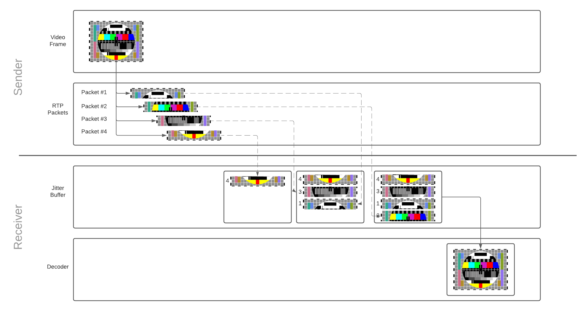

<div dir="rtl">

# چرا شبکه در ارتباطات بلادرنگ بسیار مهم است؟
شبکه ها یکی از فاکتور های محدود کننده در ارتباطات بلادرنگ هستند. در دنیای ایده آل، پهنای باند نامحدودی خواهیم داشت
و بسته ها فوراً می رسند. هرچند اینطور نیست شبکه ها محدود هستند و شرایط
می تواند در هر زمان تغییر کند و اندازه گیری و مشاهده شرایط شبکه نیز در هر لحظه مشکل سختی است. شما می توانید رفتارهای مختلفی داشته باشید
بسته به سخت افزار، نرم افزار و پیکربندی آن.

ارتباط بلادرنگ نیز مشکلی را ایجاد می کند که در اکثر حوزه های دیگر وجود ندارد. برای یک توسعه دهنده وب چالش بزرگی نیست
اگر وب سایت شما در برخی از شبکه ها کندتر باشد. تا زمانی که همه داده ها به دست می آیند، کاربران خوشحال هستند. با WebRTC، اگر داده های شما دیر ارسال شوددیگر  بی فایده است و هیچ کس به آنچه در یک کنفرانس تلفنی 5 ثانیه پیش گفته شد اهمیت نمی دهد. بنابراین هنگام توسعه یک سیستم ارتباطی بلادرنگ،
شما باید یک معامله انجام دهید و آن هم این است که از خود بپرسید محدودیت زمانی من چقدر است و چه مقدار داده می توانم ارسال کنم؟

این فصل مفاهیمی را پوشش می دهد که هم برای داده ها و هم برای ارتباطات رسانه ای کاربرد دارند. در فصل های بعدی فراتر می رویم
نظری و بحث در مورد اینکه چگونه رسانه ها و زیرسیستم های WebRTC این مشکلات را حل می کنند می پردازیم.

## ویژگی های شبکه چیست که آن را دشوار می کند؟
کدی که به طور موثر در تمامی شبکه ها کار کند، بسیار پیچیده است. شما عوامل مختلف زیادی دارید، و همه آنها می توانند به طور ماهرانه روی یکدیگر تأثیر بگذارند. اینها رایج ترین مشکلاتی هستند که توسعه دهندگان با آن ها مواجه می شوند.

#### پهنای باند
پهنای باند حداکثر نرخ داده ای است که می تواند در یک مسیر مشخص منتقل شود. مهم است که به یاد داشته باشید
این هم یک عدد ثابت نیست پهنای باند در طول مسیر تغییر می کند زیرا افراد بیشتر (یا کمتر) از آن استفاده می کنند.

#### زمان انتقال و زمان رفت و برگشت
زمان انتقال مدت زمانی است که طول می کشد تا یک بسته به مقصد برسد. همانند پهنای باند این ثابت نیست. زمان انتقال می تواند در هر زمان تغییر کند.

(`زمان_انتقال = زمان_دریافت - زمان_ارسال`) `transmission_time = receive_time - send_time`

برای محاسبه زمان ارسال، به ساعت های فرستنده و گیرنده نیاز دارید که با دقت میلی ثانیه همگام سازی شده باشند.
حتی یک انحراف کوچک می تواند یک اندازه گیری زمان انتقال غیر قابل اعتماد ایجاد کند.
از آنجایی که WebRTC در محیط‌های بسیار ناهمگن عمل می‌کند، تکیه بر همگام‌سازی زمانی کامل بین میزبان‌ها تقریباً غیرممکن است.

اندازه گیری زمان رفت و برگشت راه حلی برای همگام سازی ناقص ساعت است.

به جای کار بر روی ساعت های توزیع شده، یک همتای WebRTC یک بسته ویژه با مهر زمانی خود `sendertime1` ارسال می کند.
 همتای دیگر بسته را دریافت می کند و مهر زمانی را به فرستنده منعکس می کند.
هنگامی که فرستنده اصلی زمان منعکس شده را دریافت می کند، مهر زمانی `sendertime1` را از زمان فعلی `sendertime2` کم می کند.
این دلتای زمانی `تاخیر انتشار رفت و برگشت` یا معمولاً زمان رفت و برگشت نامیده می شود.

`rtt = sendertime2 - sendertime1`

نیمی از زمان رفت و برگشت به اندازه کافی تقریب خوبی را برای زمان انتقال، در نظر می گیرد.
این راه حل هم بدون اشکال نیست.
این فرض را ایجاد می کند که آیا ارسال و دریافت بسته ها زمان برابری را می برد.
اما در شبکه های سلولی، عملیات ارسال و دریافت ممکن است متقارن زمان نباشد.
شاید متوجه شده باشید که سرعت آپلود روی گوشی شما تقریباً همیشه کمتر از سرعت دانلود است.

`transmission_time = rtt/2`

نکات فنی اندازه گیری زمان رفت و برگشت با جزئیات بیشتر در [فصل گزارش های فرستنده و گیرنده RTCP](../06-media-communication/#senderreceiver-reports) توضیح داده شده است.

#### Jitter
جیتر این واقعیت است که `زمان انتقال` ممکن است برای هر بسته متفاوت باشد. بسته های شما ممکن است به تعویق بیفتد، اما سپس به صورت رگباری می رسند.

#### از دست دادن بسته
Packet Loss زمانی است که پیام ها در انتقال گم می شوند. نرخ از دست رفتن می تواند ثابت باشد، یا ممکن است به صورت ناگهانی رخ دهد.
این ممکن است به دلیل نوع شبکه مانند ماهواره یا Wi-Fi باشد. یا ممکن است در طول مسیر توسط نرم افزار ایجاد شده باشد.

#### حداکثر واحد انتقال
حداکثر واحد انتقال محدودیتی است که یک بسته واحد چقدر می تواند بزرگ باشد. اگر بسته شما بسیار بزرگ باشد، شبکه ها به شما اجازه ارسال نمی دهند
یک پیام غول پیکر در سطح پروتکل، ممکن است پیام ها به چندین بسته کوچکتر تقسیم شوند.

بسته به مسیر شبکه ای که انتخاب می کنید، MTU نیز متفاوت خواهد بود. می توانید
از پروتکلی مانند [Path MTU Discovery](https://tools.ietf.org/html/rfc1191) استفاده کنید تا بزرگترین اندازه بسته ای را که می توانید ارسال کنید، تعیین کنید.

### ازدحام
ازدحام زمانی است که به محدودیت های شبکه رسیده باشد. این معمولاً به این دلیل است که شما به اوج رسیده اید
پهنای باندی که مسیر فعلی می تواند از عهده آن برآید. یا ممکن است اپراتور اعمال شود مانند محدودیت های ساعتی که ISP شما را پیکربندی می کند.

ازدحام به طرق مختلف خود را نشان می دهد و هیچ رفتار استانداردی وجود ندارد. در بیشتر موارد زمانی که ازدحام رخ می دهد،
شبکه بسته های اضافی را رها می کند. در موارد دیگر شبکه بافر خواهد شد. این باعث بالا رفتن زمان انتقال می شود
. همچنین می توانید با شلوغ شدن شبکه خود، لگ های بیشتری را مشاهده کنید. این مبحث به سرعت در حال تغییر است
و الگوریتم های جدید برای تشخیص تراکم هنوز در حال نوشتن هستند.

### پویا بودن
شبکه ها فوق العاده پویا هستند و شرایط می توانند به سرعت تغییر کند. در طول یک تماس می توانید صدها هزار بسته ارسال و دریافت کنید.
این بسته‌ها از طریق چندین هاب منتقل خواهند شد. این هاب ها توسط میلیون ها کاربر دیگر به اشتراک گذاشته خواهد شد. حتی در شبکه محلی خود می توانید 
فیلم‌های HD در حال دانلود داشته باشید یا شاید دستگاهی تصمیم به دانلود به‌روزرسانی نرم‌افزاری بگیرد.

داشتن یک تماس خوب به اندازه اندازه گیری شبکه در هنگام راه اندازی ساده نیست. باید مدام در حال ارزیابی باشید. شما همچنین نیاز دارید همه ی رفتار هایی که از نرم افرار و سخت افزار می آید را ارزیابی کنید.

## راه حلی برای از دست دادن بسته
مدیریت از دست دادن بسته اولین مشکلی است که باید حل شود. راه های مختلفی برای حل آن وجود دارد که هر کدام مزایای خاص خود را دارند. بسته به این که چه چیزی و یا چگونه ارسال می کنید
ممکن است متحمل تاخیر شوید همچنین مهم است که همه از دست دادن بسته ها چالش پذیر نیستند. از دست دادن برخی ویدیوها ممکن است مشکلی ایجاد نکند، ممکن است چشم انسان مشکلی نداشته باشد
حتی قادر به درک آن نباشد. از دست دادن پیام های متنی کاربران می ت.اند بسیار چالشی باشد است.

فرض کنید 10 بسته ارسال می کنید و بسته های 5 و 6 گم می شوند. در اینجا راه هایی وجود دارد که می توانید آن را حل کنید.

### Acknowledgments
تصدیق زمانی است که گیرنده، فرستنده را از هر بسته ای که دریافت می کند مطلع می سازد. فرستنده زمانی از گم شدن بسته آگاه خواهد شد که
برای یک بسته دو بار تصدیق دریافت کند در حالی که بسته ها تمام نشده اند. هنگامی که فرستنده دو بار یک `ACK` برای بسته 4 دریافت می کند، می داند که بسته 5 هنوز نرسیده است.

### Acknowledgment های انتخابی
تصدیق های انتخابی بهبودی از تصدیق است. یک گیرنده می تواند یک `SACK` ارسال کند که چندین بسته را تأیید می کند و به فرستنده از شکاف ها اطلاع می دهد.
اکنون فرستنده می تواند یک `SACK` برای بسته 4 و 7 دریافت کند. سپس می داند که باید بسته های 5 و 6 را دوباره ارسال کند.

### Acknowledgment های منفی
قدردانی های منفی مشکل را برعکس حل می کند. گیرنده به جای اطلاع دادن به فرستنده که آنچه را دریافت کرده است، به فرستنده اطلاع می دهد که چه چیزی گم شده است. در مورد ما یک `NACK`
برای بسته های 5 و 6 ارسال می شود. فرستنده فقط بسته هایی را می داند که گیرنده می خواهد دوباره ارسال کند.

### تصحیح خطای فوروارد
Forward Error Correction به طور پیشگیرانه از دست دادن بسته را برطرف می کند. فرستنده داده های اضافی را ارسال می کند، به این معنی که یک بسته از دست رفته بر نتیجه نهایی تأثیر نمی گذارد. یکی از الگوریتم های محبوب برای
این تصحیح خطا `Reed-Solomon` است.

این امر تأخیر و پیچیدگی ارسال و رسیدگی به تصدیق ها را کاهش می دهد. اگر شبکه ای که در آن هستید صفر درصد هدر رفتن بسته داشته باشد، تصحیح خطای فوروارد اتلاف پهنای باند است.

## حل Jitter
جیتر در اکثر شبکه ها وجود دارد. حتی در داخل شبکه LAN، دستگاه‌های زیادی هستند که داده‌ها را با نرخ‌های متغیر ارسال می‌کنند. شما به راحتی می توانید با پینگ کردن دستگاه دیگری با فرمان `ping` و مشاهده نوسانات تأخیر رفت و برگشت و بالا و پایین شدن شبکه را مشاهده کنید.

برای حل جیتر، کلاینت ها از JitterBuffer استفاده می کنند. JitterBuffer زمان تحویل ثابت بسته ها را تضمین می کند. نکته منفی این است که JitterBuffer مقداری تاخیر به بسته هایی که زودتر می رسند اضافه می کند.
نکته مثبت این است که بسته‌های دیرهنگام باعث Jitter نمی‌شوند. تصور کنید که در طول یک تماس، زمان‌های رسیدن بسته زیر را مشاهده می‌کنید:

```
* time=1.46 ms
* time=1.93 ms
* time=1.57 ms
* time=1.55 ms
* time=1.54 ms
* time=1.72 ms
* time=1.45 ms
* time=1.73 ms
* time=1.80 ms
```

در این مورد، حدود 1.8 میلی ثانیه انتخاب خوبی خواهد بود. بسته هایی که دیر می رسند از `پنجره تاخیر` استفاده می کنند. بسته‌هایی که زودتر می‌رسند کمی تأخیر خواهند داشت و می‌توانند
`پنجره تخلیه` شده توسط بسته های تاخیری را پر کنید. این به این معنی است که ما دیگر وقفه نداریم و نرخ تحویل آرامی را برای مشتری فراهم می کنیم.

### عملیات JitterBuffer



هر بسته به محض دریافت به بافر jitter اضافه می شود.
هنگامی که بسته های کافی برای بازسازی قاب وجود دارد، بسته هایی که فریم را تشکیل می دهند از بافر آزاد می شوند و برای دیکود شدن منتشر می شوند.
دیکودر نیز به نوبه خود، فریم ویدیو را روی صفحه کاربر دیکود و ترسیم می کند.
از آنجایی که بافر جیتر ظرفیت محدودی دارد، بسته هایی که برای مدت طولانی در بافر می مانند، دور ریخته می شوند.

در مورد چگونگی تبدیل فریم های ویدئویی به بسته های RTP و چرایی نیاز به بازسازی [در فصل ارتباطات رسانه ای](../06-media-communication/#rtp) بیشتر بخوانید.

`jitterBufferDelay` بینشی عالی از عملکرد شبکه شما و تأثیر آن بر روان بودن پخش ارائه می دهد.
این بخشی از [WebRTC statistics API](https://www.w3.org/TR/webrtc-stats/#dom-rtcinboundrtpstreamstats-jitterbufferdelay) مربوط به جریان ورودی گیرنده است.
تأخیر مقدار زمانی را که فریم‌های ویدیویی در بافر لرزاننده قبل از انتشار برای دیکود شدن می‌گذرد، را نشان می دهد.
تاخیر طولانی بافر جیتر به این معنی است که شبکه شما به شدت شلوغ است.

## تشخیص ازدحام
قبل از اینکه بتوانیم ازدحام را حل کنیم، باید آن را تشخیص دهیم. برای تشخیص آن از یک کنترل کننده ازدحام استفاده می کنیم. این موضوع پیچیده ای است و هنوز هم به سرعت در حال تغییر است.
الگوریتم های جدید هنوز در حال انتشار و آزمایش هستند. در سطح بالا، همه آنها یکسان عمل می کنند. یک کنترل کننده ازدحام با توجه به برخی ورودی ها، تخمین پهنای باند را ارائه می دهد.
اینها برخی از ورودی های ممکن هستند:

* **از دست دادن بسته** - با شلوغ شدن شبکه، بسته ها حذف می شوند 
* **Jitter** - تجهیزات شبکه باعث سرریز شدن بسته در صف می شدن که موجب می شود که زمان به بی نهایت میل کند.
* **زمان رفت و برگشت** - بسته ها در صورت شلوغی زمان بیشتر طول می کشد تا بسته به دستشان برسند. برخلاف جیتر، زمان رفت و برگشت همچنان افزایش می یابد.
* **اعلان تراکم صریح** - شبکه های جدیدتر ممکن است بسته ها را به عنوان در معرض خطر رها شدن برای کاهش ازدحام برچسب گذاری کنند.

این مقادیر باید به طور مداوم در طول تماس اندازه گیری شوند. استفاده از شبکه ممکن است افزایش یا کاهش یابد، بنابراین پهنای باند موجود می تواند دائما در حال تغییر باشد.

## حل تراکم
اکنون که پهنای باند تخمینی داریم باید آنچه را که ارسال می کنیم تنظیم کنیم. نحوه تنظیم بستگی به نوع داده ای دارد که می خواهیم ارسال کنیم.

### ارسال کندتر
محدود کردن سرعت ارسال داده ها اولین راه حل برای جلوگیری از ازدحام است. کنترل ازدحام به شما تخمینی می دهد، که مسئولیت فرستنده است که نرخ را محدود کند.

این روشی است که برای اکثر ارتباطات داده استفاده می شود. با پروتکل هایی مانند TCP همه اینها توسط سیستم عامل انجام می شود و برای کاربران و توسعه دهندگان کاملاً شفاف است.

### ارسال کمتر
در برخی موارد ما می توانیم اطلاعات کمتری برای برآورده کردن محدودیت های خود ارسال کنیم. ما همچنین ضرب الاجل های صفت و سختی برای رسیدن داده‌هایمان داریم، بنابراین نمی‌توانیم کندتر ارسال کنیم. اینها محدودیت هایی هستند
که رسانه بلادرنگ تحت تتاثیر آن قرار می گیرد.

اگر پهنای باند کافی در دسترس نداریم، می‌توانیم کیفیت ویدیویی را که ارسال می‌کنیم کاهش دهیم. این بستگی به دیکودر ویدیوی شما و کنترل کننده ازدحام شما دارد.

</div>
