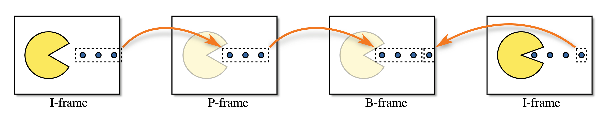
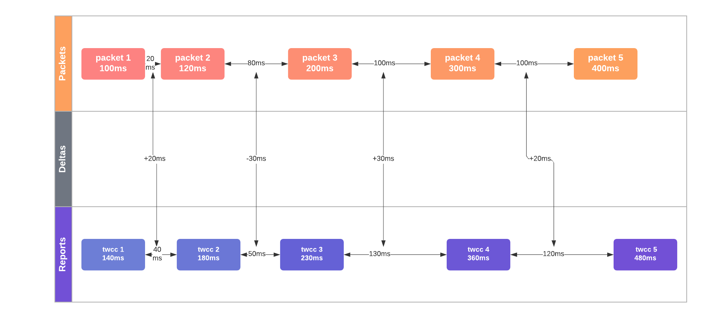
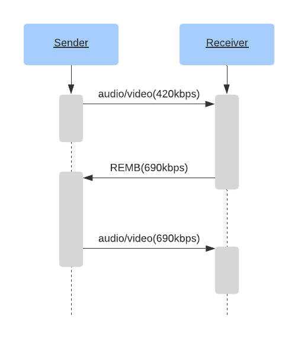

<div dir="rtl">

#ارتباطات رسانه ای

## از ارتباطات رسانه ای WebRTC چه چیزی دریافت می کنم؟

WebRTC به شما امکان ارسال و دریافت تعداد نامحدودی از جریان های صوتی و تصویری را می دهد. می‌توانید این جریان‌ها را در هر زمانی در طول تماس اضافه و حذف کنید. این جریان ها می توانند همه مستقل باشند، یا می توانند با هم جمع شوند! می توانید یک فید ویدیویی از دسکتاپ خود ارسال کنید و سپس صدا و تصویر را از وب کم خود اضافه کنید.

پروتکل WebRTC کدک آگنوستیک(با همه ی دستگاه ها و سیستم عامل ها کار می کند) است. حمل و نقل زیربنایی از همه چیز پشتیبانی می کند، حتی چیزهایی که هنوز وجود ندارند! با این حال، عامل WebRTC که با آن در ارتباط هستید ممکن است ابزار لازم برای پذیرش آن را نداشته باشد.

WebRTC همچنین برای رسیدگی به شرایط شبکه پویا طراحی شده است. در طول تماس، پهنای باند شما ممکن است افزایش یا کاهش یابد. شاید به طور ناگهانی از دست دادن بسته های زیادی را تجربه کنید. پروتکل برای رسیدگی به همه اینها طراحی شده است. WebRTC به شرایط شبکه پاسخ می دهد و سعی می کند بهترین تجربه ممکن را با منابع موجود به شما ارائه دهد.

## چگونه کار می کند؟
WebRTC از دو پروتکل از پیش موجود RTP و RTCP استفاده می کند که هر دو در [RFC 1889](https://tools.ietf.org/html/rfc1889) تعریف شده اند.

RTP (پروتکل ارتباطی در زمان بی درنگ) پروتکلی است که رسانه(صدا و تصویر) را منتقل می کند. این به گونه ای طراحی شده است که امکان ارسال بلادرنگ ویدیو را فراهم کند. هیچ قاعده‌ای در مورد تأخیر یا قابلیت اطمینان تعیین نمی‌کند، اما ابزارهایی را برای پیاده‌سازی آنها در اختیار شما قرار می‌دهد. RTP به شما جریان رسانه ای (صدا و تصویر) ارایه می دهد، بنابراین می توانید چندین خط رسانه(چندین صدا و تصویر) را روی یک اتصال بفرستید. همچنین زمان بندی و اطلاعات سفارشی را که برای مقدار دهی اولیه خط رسانه نیاز دارید در اختیار شما قرار می دهد.

RTCP (پروتکل کنترل RTP) پروتکلی است که فرا داده یا متادیتا را در مورد تماس تعیین می کند. قالب فراداده بسیار منعطف است و به شما امکان می دهد هر فراداده ای را که می خواهید اضافه کنید. از این مورد برای برقراری ارتباط آماری در مورد تماس استفاده می شود(مانند پهنای باند و نرخ فریم). همچنین برای کنترل از دست دادن بسته ها و اجرای کنترل ازدحام استفاده می شود. این پروتکل ارتباط دو طرفه لازم برای پاسخ به شرایط متغیر شبکه را به شما می دهد.

## تاخیر و کیفیت
در رسانه های بلادرنگ توازنی(تریدآف) بین تأخیر و کیفیت وجود دارد. هرچه زمان تاخیر بیشتری را تحمل کنید، می توانید انتظار ویدیوی با کیفیت بالاتری داشته باشید.

### محدودیت های دنیای واقعی
این محدودیت ها همه ناشی از محدودیت های دنیای واقعی است. همه آنها ویژگی های شبکه شما هستند که باید بر آنها غلبه کنید.

### ویدئو پیچیده است
ارتباط ویدئویی آسان نیست. برای ذخیره 30 دقیقه ویدیوی 720 8 بیتی فشرده نشده، به حدود 110 گیگابایت حافظه نیاز دارید. با این حجم از حافظه، یک کنفرانس تلفنی 4 نفره اتفاق نمی افتد. ما به راهی برای کوچکتر کردن آن نیاز داریم و پاسخ آن فشرده سازی ویدیو است. هر چند که مشکلاتی نیز به بار می آورد.

## ویدئو 101
ما قصد نداریم فشرده سازی ویدیو را به طور عمیق پوشش دهیم، بلکه به اندازه ای است که بفهمیم چرا RTP به این شکل طراحی شده توضیح خواهیم داد. فشرده‌سازی ویدیو، ویدیو را در قالب جدیدی کد می‌کند که برای نمایش همان ویدیو به بیت‌های کمتری نیاز دارد.

### فشرده سازی Lossy and Lossless
می‌توانید ویدیو را به گونه‌ای کد کنید که بدون اتلاف (هیچ اطلاعاتی از بین نرود) باشد یا با اتلاف (ممکن است اطلاعات از بین برود) باشد. از آنجایی که کد کردن بدون اتلاف نیاز به داده های بیشتری برای ارسال به همتا دارد، که باعث می شود جریان تاخیری بالاتر و بسته های حذف شده بیشتری ایجاد شود، RTP معمولاً از فشرده سازی با اتلاف استفاده می کند حتی اگر کیفیت ویدیو به خوبی نباشد.

### فشرده سازی درون و بین قاب
فشرده سازی ویدئو در دو نوع ارائه می شود. اولین مورد درون قاب یا فریم است(فشرده سازی خود فریم). فشرده سازی درون فریم بیت های مورد استفاده برای توصیف یک فریم ویدئو را کاهش می دهد. از همین روش ها برای فشرده سازی تصاویر ثابت استفاده می شود، مانند روش فشرده سازی JPEG.

نوع دوم فشرده سازی بین قاب(فریم) است. از آنجایی که ویدیو از تصاویر زیادی تشکیل شده است، ما به دنبال راه هایی هستیم که اطلاعات یکسانی را دوبار ارسال نکنیم.

### انواع بین فریم
سپس شما سه نوع قاب دارید:

* **I-Frame** - یک تصویر کامل، می تواند بدون هیچ چیز دیگری رمزگشایی شود.
* **P-Frame** - یک تصویر جزئی که فقط شامل تغییرات نسبت به عکس قبلی است.
* **B-Frame** - یک تصویر جزئی، اصلاحی از تصاویر قبلی و آینده است.

در زیر تصویر سه نوع قاب وجود دارد.



### ویدئو حساس است
فشرده‌سازی ویدیو به‌طور باورنکردنی چند حالتی است و انتقال آن را از طریق اینترنت دشوار می‌کند. اگر بخشی از I-Frame را گم کنید چه اتفاقی می‌افتد؟ چگونه یک P-Frame می داند چه چیزی را باید تغییر دهد؟ همانطور که فشرده سازی ویدئو پیچیده تر می شود، این مشکل حتی بیشتر می شود. خوشبختانه RTP و RTCP راه حلی برای این مشکل دارند.

## RTP
### قالب بسته
هر بسته RTP دارای ساختار زیر است:

```
 0                   1                   2                   3
 0 1 2 3 4 5 6 7 8 9 0 1 2 3 4 5 6 7 8 9 0 1 2 3 4 5 6 7 8 9 0 1
+-+-+-+-+-+-+-+-+-+-+-+-+-+-+-+-+-+-+-+-+-+-+-+-+-+-+-+-+-+-+-+-+
|V=2|P|X|  CC   |M|     PT      |       Sequence Number         |
+-+-+-+-+-+-+-+-+-+-+-+-+-+-+-+-+-+-+-+-+-+-+-+-+-+-+-+-+-+-+-+-+
|                           Timestamp                           |
+-+-+-+-+-+-+-+-+-+-+-+-+-+-+-+-+-+-+-+-+-+-+-+-+-+-+-+-+-+-+-+-+
|           Synchronization Source (SSRC) identifier            |
+=+=+=+=+=+=+=+=+=+=+=+=+=+=+=+=+=+=+=+=+=+=+=+=+=+=+=+=+=+=+=+=+
|            Contributing Source (CSRC) identifiers             |
|                             ....                              |
+-+-+-+-+-+-+-+-+-+-+-+-+-+-+-+-+-+-+-+-+-+-+-+-+-+-+-+-+-+-+-+-+
|                            Payload                            |
+-+-+-+-+-+-+-+-+-+-+-+-+-+-+-+-+-+-+-+-+-+-+-+-+-+-+-+-+-+-+-+-+
```

#### نسخه (V)
`نسخه` همیشه `2` است

#### پدینگ (P)
`Padding` یک صفر و یک(بولین) است که کنترل می‌کند آیا محموله دارای بالشتک(پدینگ) است.

آخرین بایت محموله، حاوی تعداد بایت های padding اضافه شده است.

#### پسوند (X)
اگر تنظیم شود، هدر RTP پسوندهایی خواهد داشت. این با جزئیات بیشتر در زیر توضیح داده شده است.

#### تعداد CSRC (CC)
تعداد شناسه‌های `CSRC` که بعد از `SSRC` و قبل از بارگذاری تعیین می شوند.

#### نشانگر (M)
بیت نشانگر معنای از پیش تعیین شده ای ندارد و می تواند هر طور که کاربر دوست دارد استفاده شود.

در برخی موارد زمانی تنظیم می شود که کاربر در حال صحبت است. همچنین معمولاً برای علامت گذاری یک فریم کلیدی استفاده می شود.

#### نوع بار (PT)
`Payload Type` یک شناسه منحصر به فرد برای کدک هایی است که توسط این بسته منتقل می شود.

برای WebRTC `نوع بار` پویا است. VP8 در یک تماس ممکن است با دیگری متفاوت باشد. پیشنهاد دهنده در تماس، نگاشت `انواع بار` را به کدک‌ها در `شرح جلسه(SDP)` تعیین می‌کند.

#### شماره ترتیب
`Sequence Number` برای ترتیب گرفتن بسته ها در یک جریان استفاده می شود. هر بار که یک بسته ارسال می شود، `شماره ترتیبی` یک عدد افزایش می یابد.

RTP به گونه ای طراحی شده است که در شبکه های با اتلاف قابل استفاده باشد. این به گیرنده راهی می دهد تا تشخیص دهد که چه زمانی بسته ها گم شده است.

#### مهر زمانی
لحظه ای است که بسته برای ارسال آماده می شود. این مهر زمانی یک ساعت جهانی نیست، بلکه چقدر زمان در جریان رسانه ها سپری شده است. چندین بسته RTP می توانند دارای مهر زمانی یکسانی باشند اگر برای مثال همه آنها بخشی از یک قاب ویدیو باشند.

#### منبع همگام سازی (SSRC)
`SSRC` شناسه منحصربه‌فرد برای این جریان است. این به شما امکان می دهد چندین جریان رسانه را روی یک جریان RTP منتقل کنید.

#### منبع اضافه کننده (CSRC)
فهرستی که آنچه را که `SSRC` به این بسته اضافه کرده است را بیان می‌کند.

این معمولا برای نشان دادن صحبت کردن استفاده می شود. فرض کنید در سمت سرور چندین فید صوتی را در یک جریان RTP ترکیب کرده اید. سپس می توانید از این فیلد برای گفتن "جریان ورودی A و C در این لحظه صحبت می کردند" استفاده کنید.

#### Payload
 اگر پرچم padding تنظیم شده باشد، داده های بار واقعی ممکن است با شمارش تعداد بایت های padding اضافه شده به پایان برسد.

### برنامه های افزودنی

## RTCP

### قالب بسته
هر بسته RTCP ساختار زیر را دارد:

```
 0                   1                   2                   3
 0 1 2 3 4 5 6 7 8 9 0 1 2 3 4 5 6 7 8 9 0 1 2 3 4 5 6 7 8 9 0 1
+-+-+-+-+-+-+-+-+-+-+-+-+-+-+-+-+-+-+-+-+-+-+-+-+-+-+-+-+-+-+-+-+
|V=2|P|    RC   |       PT      |             length            |
+-+-+-+-+-+-+-+-+-+-+-+-+-+-+-+-+-+-+-+-+-+-+-+-+-+-+-+-+-+-+-+-+
|                            Payload                            |
+-+-+-+-+-+-+-+-+-+-+-+-+-+-+-+-+-+-+-+-+-+-+-+-+-+-+-+-+-+-+-+-+
```

#### نسخه (V)
`نسخه` همیشه `2` است.

#### Padding (P)
`Padding` یک صفر یا یک(بولین) است که کنترل می‌کند آیا محموله دارای بالشتک یا پدینگ است یا خیر.

آخرین بایت محموله حاوی تعداد بایت های padding اضافه شده است.

#### تعداد گزارش پذیرش (RC)
تعداد گزارش ها در یک بسته RTCP می تواند شامل چندین رویداد باشد.

#### نوع بسته (PT)
شناسه منحصر به فرد برای نوع بسته RTCP را نوع بسته می گویند. یک نماینده WebRTC نیازی به پشتیبانی از همه این انواع ندارد و پشتیبانی بین Agent ها می تواند متفاوت باشد. اینها مواردی هستند که معمولاً ممکن است ببینید:

* `192` - درخواست کامل درون فریم (`FIR`)
* `193` - تصدیق های(ACK) منفی ("NACK")
* `200` - گزارش فرستنده
* `201` - گزارش گیرنده
* `205` - بازخورد عمومی RTP
* `206` - بازخورد ویژه بار

اهمیت این انواع بسته در زیر با جزئیات بیشتر توضیح داده خواهد شد.

### درخواست کامل درون فریم (FIR) و نشان از دست دادن تصویر (PLI)
هر دو پیام `FIR` و `PLI` هدفی مشابه دارند. این پیام‌ها یک فریم کلید کامل از فرستنده درخواست می‌کنند.
`PLI` زمانی استفاده می‌شود که فریم‌های جزئی به رمزگشا داده می‌شود، اما قادر به رمزگشایی آنها نبوده است.
این ممکن است به این دلیل اتفاق بیفتد که شما بسته های زیادی از دست داده اید، یا شاید رمزگشا از کار افتاده است.

طبق تعریف [RFC 5104](https://tools.ietf.org/html/rfc5104#section-4.3.1.2) ، `FIR` نباید در هنگام از دست رفتن بسته ها یا فریم ها استفاده شود. این کار PLI است. `FIR` یک فریم کلیدی را به دلایلی غیر از دست دادن بسته درخواست می کند - برای مثال زمانی که یک عضو جدید وارد یک کنفرانس ویدیویی می شود. آنها برای شروع دیکود کردن جریان ویدئو به یک فریم کلید کامل نیاز دارند، رمزگشا تا رسیدن فریم کلیدی، فریم‌ها را دور می‌اندازد.

این ایده خوبی است که گیرنده بلافاصله پس از اتصال درخواست یک فریم کامل کلید را بدهد، این امر تأخیر بین اتصال و نمایش تصویر در صفحه کاربر را به حداقل می رساند.

بسته‌های `PLI` بخشی از پیام‌های بازخورد خاص Payload هستند.

در عمل، نرم‌افزاری که قادر به مدیریت هر دو بسته `PLI` و `FIR` است، در هر دو حالت یکسان عمل می‌کند. این یک سیگنال به کد کننده ارسال می کند تا یک قاب کامل کلید جدید تولید کند.

### تصدیق منفی
`NACK` درخواست می کند که یک بسته RTP تکی دوباره ارسال شود. این معمولاً به دلیل از دست رفتن بسته RTP ایجاد می شود، اما ممکن است به دلیل تاخیر هم اتفاق بیفتد.

`NACK`ها پهنای باند بسیار بیشتری نسبت به درخواست ارسال مجدد کل فریم دارند. از آنجایی که RTP بسته ها را به قطعات بسیار کوچک تقسیم می کند، شما در واقع فقط یک قطعه کوچک از دست رفته را دوباره درخواست می کنید. گیرنده یک پیام RTCP با SSRC و شماره دنباله ایجاد می کند. اگر فرستنده این بسته RTP را برای ارسال مجدد در دسترس نداشته باشد، آن گاه پیام را نادیده می گیرد.

### گزارش فرستنده و گیرنده
این گزارش ها برای ارسال آمار بین عامل ها استفاده می شود. این مقدار بسته های واقعی دریافت شده و جیتر را با هم ارتباط می دهد.

گزارش ها را می توان برای تشخیص و کنترل ازدحام استفاده کرد.

## چگونه RTP/RTCP مشکلات را با هم حل می کند
 RTP و RTCP با هم کار می کنند تا تمام مشکلات ناشی از شبکه ها را حل کنند. این تکنیک ها همچنان در حال تغییر هستند!

### تصحیح خطای بازارسال
صحیح خطای بازارسال، همچنین به عنوان FEC نیز شناخته می شود. روش دیگری برای مقابله با از دست دادن بسته است. FEC زمانی است که شما یک داده را چندین بار ارسال می کنید، بدون اینکه حتی درخواست شود. این در سطح RTP یا حتی سطح پایین‌تر با کدک انجام می شود.

اگر از دست دادن بسته برای یک تماس ثابت باشد، FEC راه حلی با تاخیر بسیار کمتری نسبت به NACK است. زمان رفت و برگشت درخواست، و سپس ارسال مجدد بسته از دست رفته می تواند برای NACK ها هم مهم باشد.

### تخمین نرخ بیت و پهنای باند تطبیقی
همانطور که در فصل [شبکه بی درنگ](../05-شبکه-بی-درنگ/) بحث شد، شبکه ها غیرقابل پیش بینی و غیرقابل اعتماد هستند. در دسترس بودن پهنای باند می تواند چندین بار در طول یک جلسه تغییر کند.
غیر معمول نیست که شاهد تغییر چشمگیر پهنای باند موجود در عرض یک ثانیه باشیم.

ایده اصلی تنظیم نرخ کدینگ بر اساس پهنای باند شبکه پیش‌بینی‌شده ی فعلی و آینده است.
این تضمین می کند که سیگنال تصویری و صوتی با بهترین کیفیت ممکن منتقل می شود و اتصال به دلیل ازدحام شبکه قطع نمی شود.
احتمالاتی که رفتار شبکه را مدل می کند و سعی می کند آن را پیش بینی کند به عنوان تخمین پهنای باند شناخته می شود.

تفاوت های ظریف زیادی در این مورد وجود دارد، بنابراین اجازه دهید جزئیات بیشتری را بررسی کنیم.

## شناسایی و برقراری ارتباط وضعیت شبکه
RTP/RTCP روی انواع شبکه‌های مختلف اجرا می‌شود و در نتیجه برای برخی رایج است
ارتباط در مسیر خود از فرستنده به گیرنده قطع شود. در سطح انتقال UDP ،
هیچ مکانیزم داخلی برای ارسال مجدد بسته وجود ندارد، چه رسد به مدیریت ازدحام.

برای ارائه بهترین تجربه به کاربران، WebRTC باید کیفیت های مربوط به مسیر شبکه را تخمین بزند و با تغییر پارامتر های شبکه، کیفیت ها در طول زمان وفق دهد. مقادیر کلیدی برای نظارت عبارتند از: در دسترس بودن
پهنای باند (در هر جهت، زیرا ممکن است متقارن نباشد)، زمان رفت و برگشت، و لرزش (نوسانات)
در رفت و برگشت. باید از دست دادن بسته ها بررسی کند و تغییرات لازم را به کیفیت ویدیو بدهد. 

دو هدف اصلی برای این پروتکل ها وجود دارد:

1. پهنای باند موجود (در هر جهت) توسط شبکه را تخمین بزند.
2. ویژگی های ارتباطی شبکه بین فرستنده و گیرنده متوجه شود.

RTP/RTCP سه رویکرد متفاوت برای رفع این مشکل دارد. همه آنها جوانب مثبت و منفی خود را دارند،
و به طور کلی هر نسل نسبت به نسل های قبلی خود پیشرفت کرده است. این که کدام پیاده سازی را قرار استفاده می کنید، در درجه اول به پشته نرم افزاری که در دسترس مشتریان شما و کتابخانه های موجود است بستگی دارد

### گزارش های گیرنده / گزارش های فرستنده
اولین پیاده سازی، جفت Receiver Reports و مکمل آن Sender Reports است. اینها
پیام‌های RTCP است که در [RFC 3550](https://tools.ietf.org/html/rfc3550#section-6.4) تعریف شده‌اند و
مسئول ارتباط وضعیت شبکه بین نقاط پایانی است. Receiver Reports بر روی این تمرکز دارد که
کیفیت های ارتباطی در مورد شبکه (از جمله از دست دادن بسته، زمان رفت و برگشت و جیتر)، و
با الگوریتم های دیگر همگام شود بعد از آن مسئول تخمین پهنای باند موجود بر اساس
این گزارش ها است.

گزارش های فرستنده و گیرنده (SR و RR) با هم تصویری از کیفیت شبکه را ترسیم می کنند. این مقادیر برای هر SSRC در یک برنامه زمانی ارسال می شود، و این مقادیر ورودی هایی هستند که هنگام تخمین شبکه استفاده می شوند
 این تخمین ها توسط فرستنده پس از دریافت داده های RR ساخته می شوند که حاوی
فیلد های زیر هستند:

* **ضریب  از دست رفتن** - چند درصد از بسته ها از آخرین گزارش گیرنده از بین رفته اند.
* **مجموع تعداد بسته های از دست رفته** - تعداد بسته هایی که در طول کل تماس از بین رفته اند.
* **بزرگترین شماره دریافت شده** - آخرین شماره دنباله دریافتی چه بوده است، و
  چند بار تکرار شده است
* **مهر زمان گزارش آخرین فرستنده** - آخرین زمان شناخته شده در فرستنده، برای محاسبه زمان رفت و برگشت استفاده می شود
  

SR و RR با هم کار می کنند تا زمان رفت و برگشت را محاسبه کنند.

فرستنده زمان محلی خود `sendertime1` که در SR است را ذخیره می کند. هنگامی که گیرنده یک بسته SR دریافت می کند، آن را دوباره به RR پس می فرستد. و یک چیز دیگر، RR نیز `sendertime1` است که به تازگی از فرستنده گرفته است ذخیره می کند.
بین دریافت SR و ارسال RR تاخیر وجود خواهد داشت. به همین دلیل، RR نیز
شامل زمان `تأخیر از آخرین گزارش فرستنده` است - که به آن `DLSR` گویند. `DLSR` برای تنظیم 
تخمین زمان رفت و برگشت در مراحل بعدی استفاده می شود. هنگامی که فرستنده RR را دریافت کرد، 
`sendertime1` و `DLSR` از زمان کنونی `sendertime2`  کم می کند. این زمان دلتا را رفت و برگشت تاخیر یا انتشار یا زمان رفت و برگشت می نامند

`rtt = sendertime2 - sendertime1 - DLSR`

زمان رفت و برگشت به زبان فارسی ساده:
- من برای شما پیامی با قرائت فعلی ساعتم ارسال می کنم، مثلا می گویم ساعت 16:20 و 42 ثانیه و 420 میلی ثانیه است.
- شما همان مُهر زمان را برای من باز می گردانید.
- شما همچنین زمان سپری شده از خواندن پیام من تا ارسال مجدد پیام، مثلاً 5 میلی ثانیه را در نظر می گیرید.
- هنگامی که زمان را به قبلی دریافت کردم، دوباره به ساعت نگاه می کنم.
- اکنون ساعت من می گوید 4:20 بعد از ظهر، 42 ثانیه و 690 میلی ثانیه.
- یعنی 265 میلی ثانیه (690 - 420 - 5) طول کشید تا بسته به شما رسید و به سمت من برگشت.
- بنابراین زمان رفت و برگشت 265 میلی ثانیه است.


<!-- Missing: What is an example congestion-control alg that pairs with RR/SR? -->

### TMMBR، TMMBN، REMB و TWCC، جفت شده با GCC

#### Google Congestion Control (GCC)
الگوریتم کنترل ازدحام Google (GCC) (به طور خلاصه در
[draft-ietf-rmcat-gcc-02](https://tools.ietf.org/html/draft-ietf-rmcat-gcc-02) توضیح داده شده است) 
به چالش تخمین پهنای باند می پردازد. این الگوریتم با انواع پروتکل های دیگر همگام می شود تا 
الزامات ارتباطی مرتبط را تسهیل کند. در نتیجه برای اجرا در هر دو طرف گیرنده (هنگامی که با TMMBR/TMMBN یا REMB اجرا می شود) و یا حتی در هر دو سمت ارسال کننده (هنگامی که با TWCC اجرا می شود) بسیار مناسب است.


برای رسیدن به تخمین‌هایی برای پهنای باند موجود، GCC روی از دست دادن بسته‌ها و نوسانات فریم تمرکز می‌کند.
زمان رسیدن به عنوان دو معیار اصلی آن می باشد. این معیارها را از طریق دو کنترلر مرتبط اجرا می کند:
کنترل کننده مبتنی بر از دست رفتن و کنترل کننده مبتنی بر تاخیر.

اولین جزء GCC، کنترل کننده مبتنی بر از دست رفتن بسیار ساده است:

* اگر از دست دادن بسته بالاتر از 10٪ باشد، تخمین پهنای باند کاهش می یابد.
* اگر از دست دادن بسته بین 2-10٪ باشد، تخمین پهنای باند ثابت می ماند.
* اگر از دست دادن بسته کمتر از 2٪ باشد، تخمین پهنای باند افزایش می یابد.

اندازه گیری از دست دادن بسته ها در بازه هایی انجام می شود. وابسته به پروتکل ارتباطی هنگام شده،
از دست دادن بسته ممکن است به طور صریح اعلام شود (مانند TWCC) یا استنباط شود (مانند TMMBR/TMMBN
و REMB). این درصدها در طول بازه های زمانی حدود یک ثانیه ارزیابی می شوند.

تابع دوم با کنترل کننده مبتنی بر از دست رفتن کار می کند و به تغییرات بسته در هنگام رسیدن بسته نگاه می کند
. هدف این کنترلر مبتنی بر تاخیر شناسایی زمانی است که شبکه های متصل به حالت ازدحام می روندو 
به طور فزاینده ای شلوغ می شود و ممکن است تخمین های پهنای باند را حتی قبل از دست دادن بسته ها کاهش دهد. در
تئوری به این گونه است که شلوغ ترین محل اتصال شبکه در طول مسیر، بسته ها را تا زمان پر شدن بافر به صف می برد. 
اگر آن روتر به دریافت بسته ادامه دهد ممکن است ترافیک بیشتر از آنچه که بتواند باز ارسال کند شود و مجبور شود تمام بسته هایی را که نمی تواند بافر کند را رها(drop) کند.
این نوع از دست رفتن بسته ها برای ارتباطات بی درنگ یا با تاخیر کم مخرب است ولی همچنین می تواند خروجی برای تمامی ارتباطات روی آن لینک را کاهش دهد و باید به صورت ایده آل از آن اجتناب شود.
بنابراین GCC قبل از اینکه از دست رفتن بسته ها رخ دهد سعی می کند بفهمد که لینک های شبکه و صف های ژرف در حال بزرگتر شدن هستند یا خیر. اگر در طول زمان تاخیر های صف بیشتر مشاده شد، استفاده پهنای باند را کاهش می دهد. 


برای رسیدن به این هدف، GCC سعی می‌کند با اندازه‌گیری افزایش‌های کم رفت و برگت بسته افزایش عمق صف را استنباط کند.
 "زمان بین ورود" فریم ها، را ثبت می کند`t(i) - t(i-1)`: تفاوت در زمان رسیدن
 دو گروه بسته (به طور کلی، فریم های ویدیویی متوالی) می باشد. این گروه از بسته ها اغلبا 
در فواصل زمانی معین (مثلاً هر 1/24 ثانیه برای یک ویدیوی 24 فریم بر ثانیه) حرکت می کند. در نتیجه،
اندازه گیری زمان بین ورود به سادگی ثبت اختلاف زمانی بین شروع 
اولین گروه بسته (یعنی فریم) و اولین فریم از گروه بعدی است.

در نمودار زیر، میانگین افزایش تاخیر بین بسته‌ها +20 میلی‌ثانیه است که نشانگر واضحی از ازدحام شبکه است



اگر زمان بین ورود در طول زمان افزایش یابد، نشانه ای از افزایش عمق صف در رابط های شبکه متصل شده فرض می شود و به عنوان ازدحام شبکه در نظر گرفته می شود. (توجه: GCC به اندازه کافی هوشمند است که این اندازه‌گیری‌ها را برای نوسانات اندازه بایت فریم کنترل کند.) GCC اندازه‌گیری‌های تاخیر خود را با استفاده از [Kalman filter](https://en.wikipedia.org/wiki/Kalman_filter)  اصلاح می‌کند و اندازه‌گیری‌های زیادی از شبکه انجام می‌دهد که شامل زمان های رفت و برگشت (و تغییرات آن) قبل از علامت گذاری ازدحام است می شود. می‌توان فیلتر کالمن GCC را به‌عنوان جایگزینی رگرسیون خطی در نظر گرفت: کمک به پیش‌بینی‌های دقیق حتی زمانی که جیتر نویز را به اندازه‌گیری‌های زمان‌بندی اضافه می‌کند. پس از علامت گذاری ازدحام، GCC نرخ بیت موجود را کاهش می دهد. از طرف دیگر، تحت شرایط ثابت شبکه، می‌تواند به آرامی تخمین‌های پهنای باند خود را افزایش دهد تا مقادیر بار بالاتر را آزمایش کند.

#### TMMBR، TMMBN، و REMB
برای TMMBR/TMMBN و REMB، طرف دریافت کننده ابتدا پهنای باند ورودی موجود را تخمین می زند (با استفاده از پروتکلی مانند GCC)، و سپس این تخمین های پهنای باند را به فرستنده های راه دور ارسال می کند. آنها نیازی به مبادله جزئیات در مورد از دست دادن بسته یا سایر خصوصیات در مورد ازدحام شبکه ندارند زیرا عملکرد در سمت گیرنده به آنها اجازه می دهد تا زمان بین ورود و از دست دادن بسته را به طور مستقیم اندازه گیری کنند. در عوض، TMMBR، TMMBN، و REMB فقط پهنای باند را که خودشان تخمین می زنند، مبادله می کنند:

* **درخواست نرخ بیت حداکثر جریان رسانه موقت** - یک مانتیس/نمای نرخ بیت درخواستی برای یک SSRC منفرد.
* **اعلان نرخ بیت حداکثر جریان رسانه موقت** - پیامی برای اطلاع از دریافت TMMBR.
* **حداکثر نرخ بیت تخمینی گیرنده** - یک مانتیس/نمای نرخ بیت درخواستی برای کل جلسه.

TMMBR و TMMBN ابتدا آمدند و در [RFC 5104](https://tools.ietf.org/html/rfc5104) تعریف شده‌اند. REMB بعداً آمد، پیش‌نویسی در[draft-alvestrand-rmcat-remb](https://tools.ietf.org/html/draft-alvestrand-rmcat-remb-03) فرستاده شد، اما هرگز استاندارد نشد.

یک نمونه جلسه که از REMB استفاده می کند و ممکن است مانند زیر عمل کند:



این روش روی کاغذ عالی عمل می کند. فرستنده تخمینی را از گیرنده دریافت می کند، نرخ بیت کدینگ را روی مقدار دریافتی تنظیم می کند. تادا! ما با شرایط شبکه سازگار شده ایم.

با این حال در عمل، رویکرد REMB دارای اشکالات متعددی است.

ناکارآمدی کدینگ اولین مورد است. هنگامی که یک بیت ریت برای کدینگ تنظیم می کنید، لزوماً نرخ بیت دقیقی را که شما درخواست کرده اید، تولید نمی کند. بسته به تنظیمات کدینگ و فریمی که کدگذاری می‌شود، ممکن است کدینگ بیت‌های بیشتر یا کمتری تولید کند.

به عنوان مثال، استفاده از کدینگ x264 با `tune= zeolatency` می تواند به طور قابل توجهی از نرخ بیت هدف مشخص شده منحرف شود. در اینجا یک سناریوی احتمالی وجود دارد:

- فرض کنید با تنظیم بیت ریت روی 1000 کیلوبیت در ثانیه شروع می کنیم.
- انکودر تنها 700 کیلوبیت در ثانیه خروجی می دهد، زیرا ویژگی های فرکانس بالا برای کدینگ کافی وجود ندارد. ("نگاه به افق(از روی بیکاری)".)
- بیایید همچنین تصور کنیم که گیرنده ویدیوی 700 کیلوبیت بر ثانیه را با اتلاف صفر دریافت کند. سپس قانون REMB 1 را اعمال می کند تا نرخ بیت ورودی را 8٪ افزایش دهد.
- گیرنده یک بسته REMB با پیشنهاد 756 کیلوبیت بر ثانیه (700 کیلوبیت در ثانیه * 1.08) برای فرستنده ارسال می کند.
- فرستنده نرخ بیت کدینگ را روی 756 کیلوبیت بر ثانیه تنظیم می کند.
- کدینگ نرخ بیت حتی کمتری را خروجی می دهد.
- این روند به تکرار خود ادامه می دهد و میزان بیت را به حداقل مطلق کاهش می دهد.

می‌توانید ببینید که چگونه این باعث تنظیم پارامترهای کدینگ سنگین می‌شود و کاربران را با ویدیوهای غیرقابل تماشا حتی در یک اتصال عالی شگفت‌زده می‌کند.

#### کنترل ازدحام گسترده ارتباطات
Transport Wide Congestion Control آخرین پیشرفت در ارتباط وضعیت شبکه RTCP است که در [draft-holmer-rmcat-transport-wide-cc-extensions-01](https://datatracker.ietf.org/doc/html/draft-holmer-rmcat-transport-wide-cc-extensions-01) تعریف شده است. ، اما هرگز استاندارد نشده است.

TWCC از یک اصل ساده استفاده می کند:


با استفاده از REMB، گیرنده طرف فرستنده نرخ بیت دانلود موجود مطلع می کند. از اندازه‌گیری‌های دقیقی در مورد از دست دادن بسته استنباط‌شده استفاده می‌کند و تنها داده‌هایی را که در مورد رسیدن بین بسته‌ها دارد، استفاده می‌کند

TWCC تقریباً یک رویکرد ترکیبی بین پروتکل‌های نسل SR/RR و REMB است. تخمین پهنای باند را به سمت فرستنده بازمی گرداند (مشابه SR/RR)، اما تکنیک تخمین پهنای باند آن بیشتر شبیه به نسل REMB است.

با TWCC، گیرنده به فرستنده اجازه می دهد زمان رسیدن هر بسته را بداند. این اطلاعات کافی برای فرستنده برای اندازه‌گیری تغییرات تأخیر رسیدن بین بسته‌ها، و همچنین شناسایی بسته‌هایی است که رها شده‌اند یا خیلی دیر رسیده‌اند تا به فید صوتی/تصویری کمک کنند. با رد و بدل شدن این داده ها به طور مکرر، فرستنده می تواند به سرعت با شرایط متغیر شبکه سازگار شود و پهنای باند خروجی خود را با استفاده از الگوریتمی مانند GCC تغییر دهد.

فرستنده بسته‌های ارسالی، شماره‌های ترتیبی، اندازه‌ها و مُهرهای زمانی آنها را پیگیری می‌کند. هنگامی که فرستنده پیام های RTCP را از گیرنده دریافت می کند، تاخیرهای ارسال بین بسته ها را با تاخیرهای دریافت مقایسه می کند. اگر تأخیر دریافت افزایش یابد، سیگنال ازدحام شبکه می دهد و فرستنده باید اقدامات اصلاحی را انجام دهد.

با ارائه داده های خام به فرستنده، TWCC نمای عالی از شرایط شبکه را در زمان واقعی ارائه می دهد:
- از رفتار از دست دادن بسته تقریباً فوری تا بسته های از دست رفته ی تکی
- ارسال بیت ریت دقیق
- نرخ بیت دریافت دقیق
- اندازه گیری Jitter 
- تفاوت بین تاخیر ارسال و دریافت بسته
- شرح نحوه تحمل شبکه، انفجاری یا ثابت

یکی از مهم ترین کمک های TWCC انعطاف پذیری است که برای توسعه دهندگان WebRTC فراهم می کند. با ادغام الگوریتم کنترل ازدحام در سمت ارسال، کد کلاینت ساده ای را امکان پذیر می کند که می تواند به طور گسترده مورد استفاده قرار گیرد و در طول زمان به حداقل پیشرفت هایی نیز نیاز دارد. الگوریتم‌های پیچیده کنترل تراکم را می‌توان با سرعت بیشتری روی سخت‌افزاری که مستقیماً کنترل می‌کنند، پیاده‌سازی کرد (مانند SFU، که در بخش 8 مورد بحث قرار گرفت). در مورد مرورگرها و دستگاه های تلفن همراه، این بدان معناست که آن کلاینت ها می توانند بدون نیاز به استانداردسازی یا به روز رسانی مرورگر (که ممکن است زمان زیادی طول بکشد تا به طور گسترده در دسترس باشند) از پیشرفت های الگوریتم بهره مند شوند.

## جایگزین های تخمین پهنای باند
بیشترین پیاده سازی "یک الگوریتم کنترل ازدحام Google برای ارتباطات بلادرنگ" است که در [draft-alvestrand-rmcat-congestion](https://tools.ietf.org/html/draft-alvestrand-rmcat-congestion-02) تعریف شده است. 

چندین جایگزین برای GCC وجود دارد، به عنوان مثال [NADA: یک طرح کنترل یکپارچه ازدحام برای رسانه های زمان واقعی](https://tools.ietf.org/html/draft-zhu-rmcat-nada-04) و [SCReAM - انطباق نرخ خودکار برای چند رسانه](https://tools.ietf.org/html/draft-johansson-rmcat-scream-cc-05).

</div>
