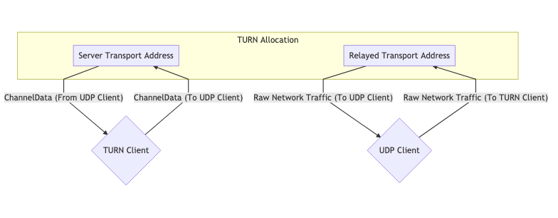

# Connecting

## Why does WebRTC need a dedicated subsystem for connecting?

Most applications deployed today establish client/server connections. A client/server connection requires the server to have a stable well-known transport address. A client contacts a server, and the server responds.

WebRTC doesn't use a client/server model, it establishes peer-to-peer (P2P) connections. In a P2P connection the task of creating a connection is equally distributed to both peers. This is because a transport address (IP and port) in WebRTC can not be assumed, and may even change during the session. WebRTC will gather all the information it can and will go to great lengths to achieve bi-directional communication between two WebRTC Agents.

Establishing peer-to-peer connectivity can be difficult though. These agents could be in different networks with no direct connectivity. In situations where direct connectivity does exist you can still have other issues. In some cases, your clients don't speak the same network protocols (UDP <-> TCP) or maybe use different IP Versions (IPv4 <-> IPv6).

Despite these difficulties in setting up a P2P connection, you get advantages over traditional Client/Server technology because of the following attributes that WebRTC offers.

### Reduced Bandwidth Costs

Since media communication happens directly between peers you don't have to pay for, or host a separate server to relay media.

### Lower Latency

Communication is faster when it is direct! When a user has to run everything through your server, it makes transmissions slower.

### Secure E2E Communication

Direct Communication is more secure. Since users aren't routing data through your server, they don't even need to trust you won't decrypt it.

## How does it work?

The process described above is called Interactive Connectivity Establishment ([ICE](https://tools.ietf.org/html/rfc8445)). Another protocol that pre-dates WebRTC.

ICE is a protocol that tries to find the best way to communicate between two ICE Agents. Each ICE Agent publishes the ways it is reachable, these are known as candidates. A candidate is essentially a transport address of the agent that it believes the other peer can reach. ICE then determines the best pairing of candidates.

The actual ICE process is described in greater detail later in this chapter. To understand why ICE exists, it is useful to understand what network behaviors we are overcoming.

## Networking real-world constraints
ICE is all about overcoming the constraints of real-world networks. Before we explore the solution, let's talk about the actual problems.

### Not in the same network
Most of the time the other WebRTC Agent will not even be in the same network. A typical call is usually between two WebRTC Agents in different networks with no direct connectivity.

Below is a graph of two distinct networks, connected over public internet. In each network you have two hosts.


For the hosts in the same network it is very easy to connect. Communication between `192.168.0.1 -> 192.168.0.2` is easy to do! These two hosts can connect to each other without any outside help.

However, a host using `Router B` has no way to directly access anything behind `Router A`. How would you tell the difference between `192.168.0.1` behind `Router A` and the same IP behind `Router B`? They are private IPs! A host using `Router B` could send traffic directly to `Router A`, but the request would end there. How does `Router A` know which host it should forward the message to?

### Protocol Restrictions
Some networks don't allow UDP traffic at all, or maybe they don't allow TCP. Some networks may have a very low MTU (Maximum Transmission Unit). There are lots of variables that network administrators can change that can make communication difficult.

### Firewall/IDS Rules
Another is "Deep Packet Inspection" and other intelligent filtering. Some network administrators will run software that tries to process every packet. Many times this software doesn't understand WebRTC, so it blocks it because it doesn't know what to do, e.g. treating WebRTC packets as suspicious UDP packets on an arbitrary port that is not whitelisted.

## NAT Mapping
NAT (Network Address Translation) mapping is the magic that makes the connectivity of WebRTC possible. This is how WebRTC allows two peers in completely different subnets to communicate, addressing the "not in the same network" problem above. While it creates new challenges, let's explain how NAT mapping works in the first place.

It doesn't use a relay, proxy, or server. Again we have `Agent 1` and `Agent 2` and they are in different networks. However, traffic is flowing completely through. Visualized it looks like this:


To make this communication happen you establish a NAT mapping. Agent 1 uses port 7000 to establish a WebRTC connection with Agent 2. This creates a binding of `192.168.0.1:7000` to `5.0.0.1:7000`. This then allows Agent 2 to reach Agent 1 by sending packets to `5.0.0.1:7000`. Creating a NAT mapping like in this example is like an automated version of doing port forwarding in your router.

The downside to NAT mapping is that there isn't a single form of mapping (e.g. static port forwarding), and the behavior is inconsistent between networks. ISPs and hardware manufacturers may do it in different ways. In some cases, network administrators may even disable it.

The good news is the full range of behaviors is understood and observable, so an ICE Agent is able to confirm it created a NAT mapping, and the attributes of the mapping.

The document that describes these behaviors is [RFC 4787](https://tools.ietf.org/html/rfc4787).

### Creating a mapping
Creating a mapping is the easiest part. When you send a packet to an address outside your network, a mapping is created! A NAT mapping is just a temporary public IP and port that is allocated by your NAT. The outbound message will be rewritten to have its source address given by the newly mapping address. If a message is sent to the mapping, it will be automatically routed back to the host inside the NAT that created it. The details around mappings is where it gets complicated.

### Mapping Creation Behaviors
Mapping creation falls into three different categories:

#### Endpoint-Independent Mapping
One mapping is created for each sender inside the NAT. If you send two packets to two different remote addresses, the NAT mapping will be re-used. Both remote hosts would see the same source IP and port. If the remote hosts respond, it would be sent back to the same local listener.

This is the best-case scenario. For a call to work, at least one side MUST be of this type.

#### Address Dependent Mapping
A new mapping is created every time you send a packet to a new address. If you send two packets to different hosts, two mappings will be created. If you send two packets to the same remote host but different destination ports, a new mapping will NOT be created.

#### Address and Port Dependent Mapping
A new mapping is created if the remote IP or port is different. If you send two packets to the same remote host, but different destination ports, a new mapping will be created.

### Mapping Filtering Behaviors
Mapping filtering is the rules around who is allowed to use the mapping. They fall into three similar classifications:

#### Endpoint-Independent Filtering
Anyone can use the mapping. You can share the mapping with multiple other peers, and they could all send traffic to it.

#### Address Dependent Filtering
Only the host the mapping was created for can use the mapping. If you send a packet to host `A` it can respond with as many packets as it wants. If host `B` attempts to send a packet to that mapping, it will be ignored.

#### Address and Port Dependent Filtering
Only the host and port for which the mapping was created for can use that mapping. If you send a packet to host `A:5000` it can respond with as many packets as it wants. If host `A:5001` attempts to send a packet to that mapping, it will be ignored.

### Mapping Refresh
It is recommended that if a mapping is unused for 5 minutes it should be destroyed. This is entirely up to the ISP or hardware manufacturer.

## STUN
STUN (Session Traversal Utilities for NAT) is a protocol that was created just for working with NATs. This is another technology that pre-dates WebRTC (and ICE!). It is defined by [RFC 8489](https://tools.ietf.org/html/rfc8489), which also defines the STUN packet structure. The STUN protocol is also used by ICE/TURN.

STUN is useful because it allows the programmatic creation of NAT Mappings. Before STUN, we were able to create a NAT mapping, but we had no idea what the IP and port of it was! STUN not only gives you the ability to create a mapping, but also gives you the details so that you can share them with others, so they can send traffic back to you via the mapping you just created.

Let's start with a basic description of STUN. Later, we will expand on TURN and ICE usage. For now, we are just going to describe the Request/Response flow to create a mapping. Then we will talk about how to get the details of it to share with others. This is the process that happens when you have a `stun:` server in your ICE URLs for a WebRTC PeerConnection. In a nutshell, STUN helps an endpoint behind a NAT figure out what mapping was created by asking a STUN server outside NAT to report what it observes.

### Protocol Structure
Every STUN packet has the following structure:

```
 0                   1                   2                   3
 0 1 2 3 4 5 6 7 8 9 0 1 2 3 4 5 6 7 8 9 0 1 2 3 4 5 6 7 8 9 0 1
+-+-+-+-+-+-+-+-+-+-+-+-+-+-+-+-+-+-+-+-+-+-+-+-+-+-+-+-+-+-+-+-+
|0 0|     STUN Message Type     |         Message Length        |
+-+-+-+-+-+-+-+-+-+-+-+-+-+-+-+-+-+-+-+-+-+-+-+-+-+-+-+-+-+-+-+-+
|                         Magic Cookie                          |
+-+-+-+-+-+-+-+-+-+-+-+-+-+-+-+-+-+-+-+-+-+-+-+-+-+-+-+-+-+-+-+-+
|                                                               |
|                     Transaction ID (96 bits)                  |
|                                                               |
+-+-+-+-+-+-+-+-+-+-+-+-+-+-+-+-+-+-+-+-+-+-+-+-+-+-+-+-+-+-+-+-+
|                             Data                              |
+-+-+-+-+-+-+-+-+-+-+-+-+-+-+-+-+-+-+-+-+-+-+-+-+-+-+-+-+-+-+-+-+
```

#### STUN Message Type
Each STUN packet has a type. For now, we only care about the following:

* Binding Request - `0x0001`
* Binding Response - `0x0101`

To create a NAT mapping we make a `Binding Request`. Then the server responds with a `Binding Response`.

#### Message Length
This is how long the `Data` section is. This section contains arbitrary data that is defined by the `Message Type`.

#### Magic Cookie
The fixed value `0x2112A442` in network byte order, it helps distinguish STUN traffic from other protocols.

#### Transaction ID
A 96-bit identifier that uniquely identifies a request/response. This helps you pair up your requests and responses.

#### Data
Data will contain a list of STUN attributes. A STUN Attribute has the following structure:

```
0                   1                   2                   3
 0 1 2 3 4 5 6 7 8 9 0 1 2 3 4 5 6 7 8 9 0 1 2 3 4 5 6 7 8 9 0 1
+-+-+-+-+-+-+-+-+-+-+-+-+-+-+-+-+-+-+-+-+-+-+-+-+-+-+-+-+-+-+-+-+
|         Type                  |            Length             |
+-+-+-+-+-+-+-+-+-+-+-+-+-+-+-+-+-+-+-+-+-+-+-+-+-+-+-+-+-+-+-+-+
|                         Value (variable)                ....
+-+-+-+-+-+-+-+-+-+-+-+-+-+-+-+-+-+-+-+-+-+-+-+-+-+-+-+-+-+-+-+-+
```

The `STUN Binding Request` uses no attributes. This means a `STUN Binding Request` contains only the header.

The `STUN Binding Response` uses a `XOR-MAPPED-ADDRESS (0x0020)`. This attribute contains an IP and port. This is the IP and port of the NAT mapping that is created!

### Create a NAT Mapping
Creating a NAT mapping using STUN just takes sending one request! You send a `STUN Binding Request` to the STUN Server. The STUN Server then responds with a `STUN Binding Response`.
This `STUN Binding Response` will contain the `Mapped Address`. The `Mapped Address` is how the STUN Server sees you and is your `NAT mapping`.
The `Mapped Address` is what you would share if you wanted someone to send packets to you.

People will also call the `Mapped Address` your `Public IP` or `Server Reflexive Candidate`.

### Determining NAT Type
Unfortunately, the `Mapped Address` might not be useful in all cases. If it is `Address Dependent`, only the STUN server can send traffic back to you. If you shared it and another peer tried to send messages in they will be dropped. This makes it useless for communicating with others. You may find the `Address Dependent` case is in fact solvable, if the STUN server can also forward packets for you to the peer! This leads us to the solution using TURN below.

[RFC 5780](https://tools.ietf.org/html/rfc5780) defines a method for running a test to determine your NAT Type. This is useful because you would know ahead of time if direct connectivity is possible.

## TURN
TURN (Traversal Using Relays around NAT) is defined in [RFC 8656](https://tools.ietf.org/html/rfc8656) is the solution when direct connectivity isn't possible. It could be because you have two NAT Types that are incompatible, or maybe can't speak the same protocol! TURN can also be used for privacy purposes. By running all your communication through TURN you obscure the client's actual address.

TURN uses a dedicated server. This server acts as a proxy for a client. The client connects to a TURN Server and creates an `Allocation`. By creating an allocation, a client gets a temporary IP/Port/Protocol that can be used to send traffic back to the client. This new listener is known as the `Relayed Transport Address`. Think of it as a forwarding address, you give this out so that others can send you traffic via TURN! For each peer you give the `Relay Transport Address` to, you must create a new `Permission` to allow communication with you.

When you send outbound traffic via TURN it is sent via the `Relayed Transport Address`. When a remote peer gets traffic they see it coming from the TURN Server.

### TURN Lifecycle
The following is everything that a client who wishes to create a TURN allocation has to do. Communicating with someone who is using TURN requires no changes. The other peer gets an IP and port, and they communicate with it like any other host.

#### Allocations
Allocations are at the core of TURN. An `allocation` is basically a "TURN Session". To create a TURN allocation you communicate with the TURN `Server Transport Address` (usually port `3478`).

When creating an allocation, you need to provide the following:
* Username/Password - Creating TURN allocations require authentication.
* Allocation Transport - The transport protocol between the server (`Relayed Transport Address`) and the peers, can be UDP or TCP.
* Even-Port - You can request sequential ports for multiple allocations, not relevant for WebRTC.

If the request succeeded, you get a response with the TURN Server with the following STUN Attributes in the Data section:
* `XOR-MAPPED-ADDRESS` - `Mapped Address` of the `TURN Client`. When someone sends data to the `Relayed Transport Address` this is where it is forwarded to.
* `RELAYED-ADDRESS` - This is the address that you give out to other clients. If someone sends a packet to this address, it is relayed to the TURN client.
* `LIFETIME` - How long until this TURN Allocation is destroyed. You can extend the lifetime by sending a `Refresh` request.

#### Permissions
A remote host can't send into your `Relayed Transport Address` until you create a permission for them. When you create a permission, you are telling the TURN server that this IP and port is allowed to send inbound traffic.

The remote host needs to give you the IP and port as it appears to the TURN server. This means it should send a `STUN Binding Request` to the TURN Server. A common error case is that a remote host will send a `STUN Binding Request` to a different server. They will then ask you to create a permission for this IP.

Let's say you want to create a permission for a host behind a `Address Dependent Mapping`. If you generate the `Mapped Address` from a different TURN server, all inbound traffic will be dropped. Every time they communicate with a different host it generates a new mapping. Permissions expire after 5 minutes if they are not refreshed.

#### SendIndication/ChannelData
These two messages are for the TURN Client to send messages to a remote peer.

SendIndication is a self-contained message. Inside it is the data you wish to send, and who you wish to send it to. This is wasteful if you are sending a lot of messages to a remote peer. If you send 1,000 messages you will repeat their IP Address 1,000 times!

ChannelData allows you to send data, but not repeat an IP Address. You create a Channel with an IP and port. You then send with the ChannelId, and the IP and port will be populated server side. This is the better choice if you are sending a lot of messages.

#### Refreshing
Allocations will destroy themselves automatically. The TURN Client must refresh them sooner than the `LIFETIME` given when creating the allocation.

### TURN Usage
TURN Usage exists in two forms. Usually, you have one peer acting as a "TURN Client" and the other side communicating directly. In some cases you might have TURN usage on both sides, for example because both clients are in networks that block UDP and therefore the connection to the respective TURN servers happens via TCP.

These diagrams help illustrate what that would look like.

#### One TURN Allocation for Communication



#### Two TURN Allocations for Communication


## ICE
ICE (Interactive Connectivity Establishment) is how WebRTC connects two Agents. Defined in [RFC 8445](https://tools.ietf.org/html/rfc8445), this is another technology that pre-dates WebRTC! ICE is a protocol for establishing connectivity. It determines all the possible routes between the two peers and then ensures you stay connected.

These routes are known as `Candidate Pairs`, which is a pairing of a local and remote transport address. This is where STUN and TURN come into play with ICE. These addresses can be your local IP Address plus a port, `NAT mapping`, or `Relayed Transport Address`. Each side gathers all the addresses they want to use, exchanges them, and then attempts to connect!

Two ICE Agents communicate using ICE ping packets (or formally called the connectivity checks) to establish connectivity. After connectivity is established, they can send whatever data they want. It will be like using a normal socket. These checks use the STUN protocol.

### Creating an ICE Agent
An ICE Agent is either `Controlling` or `Controlled`. The `Controlling` Agent is the one that decides the selected `Candidate Pair`. Usually, the peer sending the offer is the controlling side.

Each side must have a `user fragment` and a `password`. These two values must be exchanged before connectivity checks can even begin. The `user fragment` is sent in plain text and is useful for demuxing multiple ICE Sessions.
The `password` is used to generate a `MESSAGE-INTEGRITY` attribute. At the end of each STUN packet, there is an attribute that is a hash of the entire packet using the `password` as a key. This is used to authenticate the packet and ensure it hasn't been tampered with.

For WebRTC, all these values are distributed via the `Session Description` as described in the previous chapter.

### Candidate Gathering
We now need to gather all the possible addresses we are reachable at. These addresses are known as candidates.

#### Host
A Host candidate is listening directly on a local interface. This can either be UDP or TCP.

#### mDNS
An mDNS candidate is similar to a host candidate, but the IP address is obscured. Instead of informing the other side about your IP address, you give them a UUID as the hostname. You then set up a multicast listener, and respond if anyone requests the UUID you published.

If you are in the same network as the agent, you can find each other via Multicast. If you are not in the same network, you will be unable to connect (unless the network administrator explicitly configured the network to allow Multicast packets to traverse).

This is useful for privacy purposes. A user could find out your local IP address via WebRTC with a Host candidate (without even trying to connect to you), but with an mDNS candidate, now they only get a random UUID.

#### Server Reflexive
A Server Reflexive candidate is generated by doing a `STUN Binding Request` to a STUN Server.

When you get the `STUN Binding Response`, the `XOR-MAPPED-ADDRESS` is your Server Reflexive Candidate.

#### Peer Reflexive
A Peer Reflexive candidate is when you get an inbound request from an address that isn't known to you. Since ICE is an authenticated protocol, you know the traffic is valid. This just means the remote peer is communicating with you from an address it didn't know about.

This commonly happens when a `Host Candidate` communicates with a `Server Reflexive Candidate`. A new `NAT mapping` was created because you are communicating outside your subnet. Remember we said the connectivity checks are in fact STUN packets? The format of STUN response naturally allows a peer to report back the peer-reflexive address.

#### Relay
A Relay Candidate is generated by using a TURN Server.

After the initial handshake with the TURN Server you are given a `RELAYED-ADDRESS`, this is your Relay Candidate.

### Connectivity Checks
We now know the remote agent's `user fragment`, `password`, and candidates. We can now attempt to connect! Every candidate is paired with each other. So if you have 3 candidates on each side, you now have 9 candidate pairs.

Visually it looks like this:


### Candidate Selection
The Controlling and Controlled Agent both start sending traffic on each pair. This is needed if one Agent is behind an `Address Dependent Mapping`, this will cause a `Peer Reflexive Candidate` to be created.

Each `Candidate Pair` that saw network traffic is then promoted to a `Valid Candidate` pair. The Controlling Agent then takes one `Valid Candidate` pair and nominates it. This becomes the `Nominated Pair`. The Controlling and Controlled Agent then attempt one more round of bi-directional communication. If that succeeds, the `Nominated Pair` becomes the `Selected Candidate Pair`! This pair is then used for the rest of the session.

### Restarts
If the `Selected Candidate Pair` stops working for any reason (NAT mapping expires, TURN Server crashes) the ICE Agent will go to `Failed` state. Both agents can be restarted and will do the whole process all over again.
