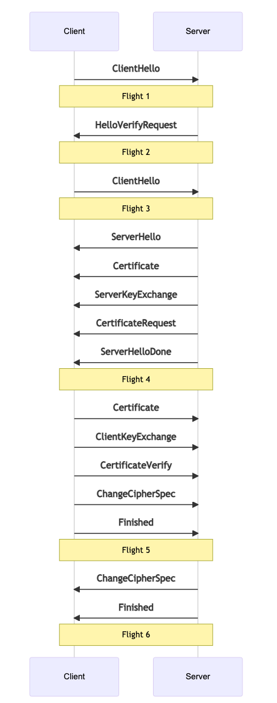

# Securing

## What security does WebRTC have?

Every WebRTC connection is authenticated and encrypted. You can be confident that a 3rd party can't see what you are sending or insert bogus messages. You can also be sure that the WebRTC Agent that generated the Session Description is the one you are communicating with.

It is very important that no one tampers with those messages. It is ok if a 3rd party reads the Session Description in transit. However, WebRTC has no protection against it being modified. An attacker could perform a man-in-the-middle attack on you by changing the ICE Candidates and update the Certificate Fingerprint.

## How does it work?
WebRTC uses two pre-existing protocols, Datagram Transport Layer Security ([DTLS](https://tools.ietf.org/html/rfc6347)) and the Secure Real-time Transport Protocol ([SRTP](https://tools.ietf.org/html/rfc3711)).

DTLS allows you to negotiate a session and then exchange data securely between two peers. It is a sibling of TLS, the same technology that powers HTTPS, but DTLS uses UDP instead of TCP as the transport layer. That means the protocol has to handle unreliable delivery. SRTP is specifically designed for exchanging media securely. There are some optimizations we can make by using it instead of DTLS.

DTLS is used first. It does a handshake over the connection provided by ICE. DTLS is a client/server protocol, so one side needs to start the handshake. The Client/Server roles are chosen during signaling. During the DTLS handshake, both sides offer a certificate.
After the handshake is complete, this certificate is compared to the certificate hash in the Session Description. This is to ensure that the handshake happened with the WebRTC Agent you expected. The DTLS connection is then available to be used for DataChannel communication.

To create an SRTP session we initialize it using the keys generated by DTLS. SRTP does not have a handshake mechanism, so has to be bootstrapped with external keys. Once this is done, media can be exchanged that is encrypted using SRTP!

## Security 101
To understand the technology presented in this chapter you will need to understand these terms first. Cryptography is a tricky subject, so it would be worth consulting other sources as well!

### Plaintext and Ciphertext

Plaintext is the input to a cipher. Ciphertext is the output of a cipher.

### Cipher

Cipher is a series of steps that takes plaintext to ciphertext. The cipher can then be reversed, so you can take your ciphertext back to plaintext. A cipher usually has a key to change its behavior. Another term for this is encrypting and decrypting.

A simple cipher is ROT13. Each letter is moved 13 characters forward. To undo the cipher you move 13 characters backward. The plaintext `HELLO` would become the ciphertext `URYYB`. In this case, the Cipher is ROT, and the key is 13.

### Hash functions

A hash function is a one-way process that generates a digest. Given an input, it generates the same output every time. It is important that the output is *not* reversible. If you have an output, you should not be able to determine its input. Hashing is useful when you want to confirm that a message hasn't been tampered with.

A simple hash function would be to only take every other letter. `HELLO` would become `HLO`. You can't assume `HELLO` was the input, but you can confirm that `HELLO` would be a match to the hash digest.

### Public/Private Key Cryptography

Public/Private Key Cryptography describes the type of ciphers that DTLS and SRTP uses. In this system, you have two keys, a public and private key. The public key is for encrypting messages and is safe to share.
The private key is for decrypting, and should never be shared. It is the only key that can decrypt the messages encrypted with the public key.

### Diffie–Hellman exchange

Diffie–Hellman exchange allows two users who have never met before to create a shared secret securely over the internet. User `A` can send a secret to User `B` without worrying about eavesdropping. This depends on the difficulty of breaking the discrete logarithm problem.
You don't need to fully understand how this works, but it helps to know this is what makes the DTLS handshake possible.

Wikipedia has an example of this in action [here](https://en.wikipedia.org/wiki/Diffie%E2%80%93Hellman_key_exchange#Cryptographic_explanation).

### Pseudorandom Function

A Pseudorandom Function (PRF) is a pre-defined function to generate a value that appears random. It may take multiple inputs and generate a single output.

### Key Derivation Function

Key Derivation is a type of Pseudorandom Function. Key Derivation is a function that is used to make a key stronger. One common pattern is key stretching.

Let's say you are given a key that is 8 bytes. You could use a KDF to make it stronger.

### Nonce

A nonce is an additional input to a cipher. This is used so that you can get different output from the cipher, even if you are encrypting the same message multiple times.

If you encrypt the same message 10 times, the cipher will give you the same ciphertext 10 times. By using a nonce you can get different output, while still using the same key. It is important you use a different nonce for each message! Otherwise, it negates much of the value.

### Message Authentication Code

A Message Authentication Code is a hash that is placed at the end of a message. A MAC proves that the message comes from the user you expected.

If you don't use a MAC, an attacker could insert invalid messages. After decrypting you would just have garbage because they don't know the key.

### Key Rotation

Key Rotation is the practice of changing your key on an interval. This makes a stolen key less impactful. If a key is stolen or leaked, fewer data can be decrypted.

## DTLS
DTLS (Datagram Transport Layer Security) allows two peers to establish secure communication with no pre-existing configuration. Even if someone is eavesdropping on the conversation, they will not be able to decrypt the messages.

For a DTLS Client and a Server to communicate, they need to agree on a cipher and the key. They determine these values by doing a DTLS handshake. During the handshake, the messages are in plaintext.
When a DTLS Client/Server has exchanged enough details to start encrypting it sends a `Change Cipher Spec`. After this message, each subsequent message will be encrypted!

### Packet Format
Every DTLS packet starts with a header.

#### Content Type
You can expect the following types:

* `20` - Change Cipher Spec
* `22` - Handshake
* `23` - Application Data

`Handshake` is used to exchange the details to start the session. `Change Cipher Spec` is used to notify the other side that everything will be encrypted. `Application Data` are the encrypted messages.

#### Version
Version can either be `0x0000feff` (DTLS v1.0) or `0x0000fefd` (DTLS v1.2) there is no v1.1.

#### Epoch
The epoch starts at `0`, but becomes `1` after a `Change Cipher Spec`. Any message with a non-zero epoch is encrypted.

#### Sequence Number
Sequence Number is used to keep messages in order. Each message increases the Sequence Number. When the epoch is incremented, the Sequence Number starts over.

#### Length and Payload
The Payload is `Content Type` specific. For a `Application Data` the `Payload` is the encrypted data. For `Handshake` it will be different depending on the message. The length is for how big the `Payload` is.

### Handshake State Machine
During the handshake, the Client/Server exchanges a series of messages. These messages are grouped into flights. Each flight may have multiple messages in it (or just one).
A Flight is not complete until all the messages in the flight have been received. We will describe the purpose of each message in greater detail below.

#### ClientHello
ClientHello is the initial message sent by the client. It contains a list of attributes. These attributes tell the server the ciphers and features the client supports. For WebRTC this is how we choose the SRTP Cipher as well. It also contains random data that will be used to generate the keys for the session.

#### HelloVerifyRequest
HelloVerifyRequest is sent by the server to the client. It is to make sure that the client intended to send the request. The Client then re-sends the ClientHello, but with a token provided in the HelloVerifyRequest.

#### ServerHello
ServerHello is the response by the server for the configuration of this session. It contains what cipher will be used when this session is over. It also contains the server random data.

#### Certificate
Certificate contains the certificate for the Client or Server. This is used to uniquely identify who we were communicating with. After the handshake is over we will make sure this certificate when hashed matches the fingerprint in the `SessionDescription`.

#### ServerKeyExchange/ClientKeyExchange
These messages are used to transmit the public key. On startup, the client and server both generate a keypair. After the handshake these values will be used to generate the `Pre-Master Secret`.

#### CertificateRequest
A CertificateRequest is sent by the server notifying the client that it wants a certificate. The server can either Request or Require a certificate.

#### ServerHelloDone
ServerHelloDone notifies the client that the server is done with the handshake.

#### CertificateVerify
CertificateVerify is how the sender proves that it has the private key sent in the Certificate message.

#### ChangeCipherSpec
ChangeCipherSpec informs the receiver that everything sent after this message will be encrypted.

#### Finished
Finished is encrypted and contains a hash of all messages. This is to assert that the handshake was not tampered with.

### Key Generation
After the Handshake is complete, you can start sending encrypted data. The Cipher was chosen by the server and is in the ServerHello. How was the key chosen though?

First we generate the `Pre-Master Secret`. To obtain this value Diffie–Hellman is used on the keys exchanged by the `ServerKeyExchange` and `ClientKeyExchange`.  The details differ depending on the chosen Cipher.

Next the `Master Secret` is generated. Each version of DTLS has a defined `Pseudorandom function`. For DTLS 1.2 the function takes the `Pre-Master Secret` and random values in the `ClientHello` and `ServerHello`.
The output from running the `Pseudorandom Function` is the `Master Secret`. The `Master Secret` is the value that is used for the Cipher.

### Exchanging ApplicationData
The workhorse of DTLS is `ApplicationData`. Now that we have an initialized cipher, we can start encrypting and sending values.

`ApplicationData` messages use a DTLS header as described earlier. The `Payload` is populated with ciphertext. You now have a working DTLS Session and can communicate securely.

DTLS has many more interesting features like renegotiation. They are not used by WebRTC, so they will not be covered here.

## SRTP
SRTP is a protocol designed specifically for encrypting RTP packets. To start an SRTP session you specify your keys and cipher. Unlike DTLS it has no handshake mechanism. All the configuration and keys were generated during the DTLS handshake.

DTLS provides a dedicated API to export the keys to be used by another process. This is defined in [RFC 5705](https://tools.ietf.org/html/rfc5705).

### Session Creation
SRTP defines a Key Derivation Function that is used on the inputs. When creating an SRTP Session the inputs are run through this to generate our keys for our SRTP Cipher. After this you can move on to processing media.

### Exchanging Media
Each RTP packet has a 16 bit SequenceNumber. These Sequence Numbers are used to keep packets in order, like a Primary Key. During a call these will rollover. SRTP keeps track of it and calls this the rollover counter.

When encrypting a packet SRTP uses the rollover counter and sequence number as a nonce. This is to ensure that even if you send the same data twice, the ciphertext will be different. This is important to prevent an attacker from identifying patterns or attempting a replay attack.
