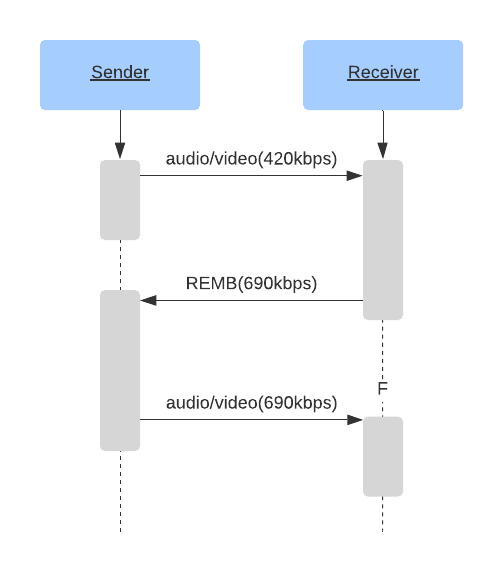

# What do I get from WebRTC's media communication?
WebRTC allows you to send and receive an unlimited amount of audio and video streams. You can add and remove these streams at anytime during a call. These streams could all be independent, or they could be bundled together! You could send a video feed of your desktop, and then include audio/video from your webcam.

The WebRTC protocol is codec agnostic. The underlying transport supports everything, even things that don't exist yet! However, the WebRTC Agent you are communicating with may not have the necessary tools to accept it.

WebRTC is also designed to handle dynamic network conditions. During a call your bandwidth might increase, or decrease. Maybe you all the sudden experience lots of packet loss. The protocol is designed to handle all of this. WebRTC responds to network conditions and tries to give you the best experience possible with the resources available.

## How does it work?
WebRTC uses two pre-existing protocols RTP and RTCP, both defined in [RFC 1889](https://tools.ietf.org/html/rfc1889)

RTP (Real-time Transport Protocol) is the protocol that carries the media. It was designed to allow for real-time delivery of video. It does not stipulate any rules around latency or reliability, but gives you the tools to implement them. RTP gives you streams, so you can run multiple media feeds over one connection. It also gives you the timing and ordering information you need to feed a media pipeline.

RTCP (RTP Control Protocol) is the protocol that communicates metadata about the call. The format is very flexible and allows you to add any metadata you want. This is used to communicate statistics about the call. It is also used to handle packet loss and to implement congestion control. It gives you the bi-directional communication necessary to respond to changing network conditions.

## Latency vs Quality
Real-time media is about making trade-offs between latency and quality. The more latency you are willing to tolerate, the higher quality video you can expect.

### Real World Limitations
These constraints are all caused by the limitations of the real world. They are all characteristics of your network that you will need to overcome.

## Media 101
### Codec
### Frame Types

## RTP
### Packet Format
Every RTP packet has the following structure:

```
 0                   1                   2                   3
 0 1 2 3 4 5 6 7 8 9 0 1 2 3 4 5 6 7 8 9 0 1 2 3 4 5 6 7 8 9 0 1
+-+-+-+-+-+-+-+-+-+-+-+-+-+-+-+-+-+-+-+-+-+-+-+-+-+-+-+-+-+-+-+-+
|V=2|P|X|  CC   |M|     PT      |       Sequence Number         |
+-+-+-+-+-+-+-+-+-+-+-+-+-+-+-+-+-+-+-+-+-+-+-+-+-+-+-+-+-+-+-+-+
|                           Timestamp                           |
+-+-+-+-+-+-+-+-+-+-+-+-+-+-+-+-+-+-+-+-+-+-+-+-+-+-+-+-+-+-+-+-+
|           Synchronization Source (SSRC) identifier            |
+=+=+=+=+=+=+=+=+=+=+=+=+=+=+=+=+=+=+=+=+=+=+=+=+=+=+=+=+=+=+=+=+
|            Contributing Source (CSRC) identifiers             |
|                             ....                              |
+-+-+-+-+-+-+-+-+-+-+-+-+-+-+-+-+-+-+-+-+-+-+-+-+-+-+-+-+-+-+-+-+
|                            Payload                            |
+-+-+-+-+-+-+-+-+-+-+-+-+-+-+-+-+-+-+-+-+-+-+-+-+-+-+-+-+-+-+-+-+
```

#### Version (V)
`Version` is always `2`

#### Padding (P)
`Padding` is a bool that controls if the payload has padding.

The last byte of the payload contains a count of how many padding bytes were added.

#### Extension (X)
If set, the RTP header will have extensions. This is described in greater detail below.

#### CSRC count (CC)
The amount of `CSRC` identifiers that follow after the `SSRC`, and before the payload.

#### Marker (M)
The marker bit has no pre-set meaning, and is up to the user.

In some cases it is set when a user is speaking. It is also commonly used to mark a keyframe.

#### Payload Type (PT)
`Payload Type` is a unique identifier for what codec is being carried by this packet.

For WebRTC the `Payload Type` is dynamic. VP8 in one call may be different then another. The Offerer in the call determines the mapping of `Payload Types` to codecs in the `Session Description`.

#### Sequence Number
`Sequence Number` is used for ordering packets in a stream. Every time a packet is sent the `Sequence Number` is incremented by one.

RTP is designed to be useful over lossy networks. This gives the receiver a way to detect when packets have been lost.

#### Timestamp
The sampling instant for this packet. This is not a global clock, but how much time has passed in the media stream.

#### Synchronization Source (SSRC)
A `SSRC` is the unique identifier for this stream. This allows you to run multiple streams of media over a single stream.

#### Contributing Source (CSRC)
A list that communicates what `SSRC`es contributed to this packet.

This is commonly used for talking indicators. Lets say server side you combined multiple audio feeds into a single RTP stream. You could then use this field to say 'Input stream A and C were talking at this moment'

#### Payload
The actual payload data. Might end with the count of how many padding bytes were added, if the padding flag is set.

### Extensions

### Mapping Payload Types to Codecs

## RTCP

### Packet Format
Every RTCP packet has the following structure:

```
 0                   1                   2                   3
 0 1 2 3 4 5 6 7 8 9 0 1 2 3 4 5 6 7 8 9 0 1 2 3 4 5 6 7 8 9 0 1
+-+-+-+-+-+-+-+-+-+-+-+-+-+-+-+-+-+-+-+-+-+-+-+-+-+-+-+-+-+-+-+-+
|V=2|P|    RC   |       PT      |             length            |
+-+-+-+-+-+-+-+-+-+-+-+-+-+-+-+-+-+-+-+-+-+-+-+-+-+-+-+-+-+-+-+-+
|                            Payload                            |
+-+-+-+-+-+-+-+-+-+-+-+-+-+-+-+-+-+-+-+-+-+-+-+-+-+-+-+-+-+-+-+-+
```

#### Version (V)
`Version` is always `2`

#### Padding (P)
`Padding` is a bool that controls if the payload has padding.

The last byte of the payload contains a count of how many padding bytes
were added.

#### Reception Report Count (RC)
The number of reports in this packet. A single RTCP Packet can contain multiple events.

#### Packet Type (PT)
Unique Identifier for what type of RTCP Packet this is. A WebRTC Agent doesn't need to support all these types, and support between Agents can be different. These are the ones you may commonly see though.

* Full INTRA-frame Request (FIR) - `192`
* Negative ACKnowledgements (NACK) - `193`
* Sender Report - `200`
* Receiver Report - `201`
* Generic RTP Feedback - `205`

The significance of these packet types will be described in greater detail below.

### Full INTRA-frame Request
This RTCP message notifies the sender that it needs to send a full image. This is for when the encoder is giving you partial frames, but you aren't able to decode them.

This could happen because you had lots of packet loss, or maybe the decoder crashed.

### Negative ACKnowledgements
A NACK requests that a sender re-transmits a single RTP Packet. This is usually caused when a RTP Packet is lost, but could also happen because it is late.

NACKs are much more bandwidth efficent then requesting that the whole frame get sent again. Since RTP breaks up packets into very small chunks, you are really just requesting one small missing piece.

### Sender/Receiver Reports
These reports are used to send statistics between agents. This communicates the amount of packets actually received and jitter.

The reports can be used for diagnostics or basic Congestion Control.

### Generic RTP Feedback

## How RTP/RTCP solve problems
RTP and RTCP then work together to solve all the problems caused by networks. These techniques are still constantly changing!

### Negative Acknowledgment
Also known as a NACK. This is one method of dealing with packet loss with RTP.

A NACK is a RTCP message sent back to a sender to request re-transmission. The receiver crafts a RTCP message with the SSRC and Sequence Number. If the sender does not have this RTP packet available to re-send, it just ignores the message.

### Forward Error Correction
Also known as FEC. Another method of dealing with packet loss. FEC is when you send the same data multiple times, without it even being requested. This is done at the RTP level, or even lower with the codec.

If the packet loss for a call is steady then FEC is a much lower latency solution than NACK. The round trip time of having to request, and then re-transmit the packet can be significant for NACKs.

### Adaptive bitrate and Bandwidth Estimation

A common problem of modern IP networks, both wireless and wired, is unpredictable and unreliable bandwidth. Network conditions are changing dynamically multiple times throughout a session. It is not uncommon to see available bandwidth change drammatically (orders of magnitude) within a second.

Unpredictability in wired networks can be caused by changing demand for bandwidth across the network, routing changes, limitations of transfer medium (fiber channel vs ethernet vs dsl) and more.

In addition to issues seen in wired networks, the nature of radio signal transmission itself, interference from multiple sources, distance to cell towers or Wi-Fi access points and physical obstacles (read walls) are some reasons for unpredictable wireless network characteristics.

WebRTC has several mechanisms to help deliver video/audio signals to the receiver despite changing network conditions.
The main idea is to adjust encoding bitrate based on predicted, current, and future available network bandwidth.
This ensures that video/audio signal of the best possible quality is transmitted and the connection does not get dropped because of network congestion.
Heuristics that model the network behavior and tries to predict it is known as Bandwidth estimation.

#### REMB

A widely supported albeit never fully standardized and now considered deprecated method is called [REMB](https://tools.ietf.org/html/draft-alvestrand-rmcat-remb-03) (Receiver Estimated Maximum Bitrate).
REMB is a special RTCP packet the receiver sends to the sender, notifying the sender of available bandwidth. There is no(?) standard method defined to estimate bandwidth associated with REMB, so the actual values are implementation dependent. A good starting point for research into details of REMB is the [Chrome source code](https://source.chromium.org/chromium/chromium/src/+/master:third_party/webrtc/modules/rtp_rtcp/source/rtcp_packet/remb.cc).

The only useful payload in the packet is the bitrate, measured in bits per second.
Notable ambiguity and a source of confusion is that REMB is defined as the _total_ bitrate, while it is common to see WebRTC libraries use it to constrain video encoding bitrate only.




### Congestion Control

Experienced WebRTC practitioners [say](https://gstconf.ubicast.tv/videos/google-transport-wide-congestion-control/) that REMB's approach leaves scars, angry looks and even laughs from Google engineers.

Congestion Control is the act of adjusting the media depending on the attributes of the network. If you don't have a lot of bandwidth, you need to send lower quality video.

Congestion Control improves WebRTC experience by providing a more fine grained control and monitoring of network connection and conditions.

#### TWCC

Transport-Wide Congestion Control (TWCC) is an advanced congestion control specification implemented in most browsers.

TWCC uses a quite simple principle:




Unlike in REMB, a TWCC receiver doesn't try to estimate it's own incoming bitrate. It just lets the sender know which packets where received and when. Based on these reports, the sender has a very up-to-date idea of what is happening in the network.

- The sender creates an RTP packet with a special TWCC header extension, containing a list of packet sequence numbers.
- The receiver responds with a special RTCP feedback message letting the sender know if and when each packet was received.

The sender keeps track of sent packets, their sequence numbers, sizes and timestamps.
When the sender receives RTCP messages from the receiver, it compares the send inter-packet delays with receive delays.
If the receive delays increase, it means network congestion is happenning and the sender must act on it.

In the diagram below, the median interpacket delay increase is +20 msec, a clear indicator of network congestion happening.




TWCC provides the raw data and an excellent view into real time network conditions:
- Almost instant packet loss statistics, not only the percentage lost, but the exact packets that were lost.
- Accurate send bitrate.
- Accurate receive bitrate.
- A jitter estimate.
- Differences between send and receive packet delays.

A trivial congestion control algrorithm to estimate the incoming bitrate on the receiver from the sender is to sum up packet sizes received, and divide it by the remote time elapsed.

More sophisticated congestion control algorithms like [A Google Congestion Control Algorithm for Real-Time Communication](https://tools.ietf.org/html/draft-alvestrand-rmcat-congestion-02), GCC for short, are built on top of the raw TWCC data.
GCC was proposed by Google and implemented in Chrome.
It predicts the current and future network bandwidth by using a [Kalman filter](https://en.wikipedia.org/wiki/Kalman_filter).

There are several alternatives to GCC, for example [NADA: A Unified Congestion Control Scheme for Real-Time Media](https://tools.ietf.org/html/draft-zhu-rmcat-nada-04) and [SCReAM - Self-Clocked Rate Adaptation for Multimedia](https://tools.ietf.org/html/draft-johansson-rmcat-scream-cc-05).

**Q**: How can I tell that TWCC is supported and enabled?

**A**: Look at the SDP offer/answer. If you see the lines below, you have TWCC negotiated on your connection:
```
a=extmap:5 http://www.ietf.org/id/draft-holmer-rmcat-transport-wide-cc-extensions
```
and
```
a=rtcp-fb:96 transport-cc
```

### JitterBuffer
