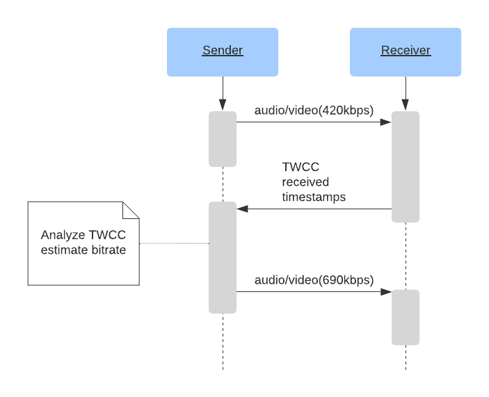
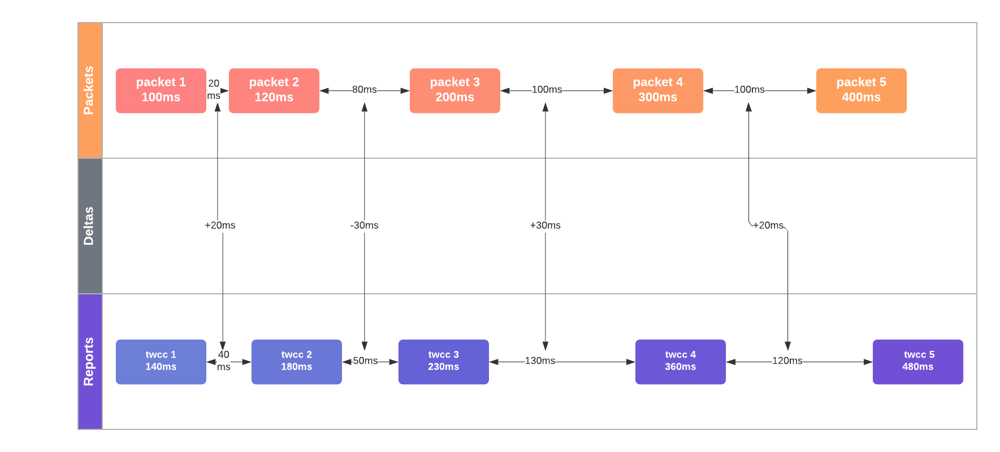

# What do I get from WebRTC's media communication?
WebRTC allows you to send and receive an unlimited amount of audio and video streams. You can add and remove these streams at anytime during a call. These streams could all be independent, or they could be bundled together! You could send a video feed of your desktop, and then include audio and video from your webcam.

The WebRTC protocol is codec agnostic. The underlying transport supports everything, even things that don't exist yet! However, the WebRTC Agent you are communicating with may not have the necessary tools to accept it.

WebRTC is also designed to handle dynamic network conditions. During a call your bandwidth might increase, or decrease. Maybe you suddenly experience lots of packet loss. The protocol is designed to handle all of this. WebRTC responds to network conditions and tries to give you the best experience possible with the resources available.

## How does it work?
WebRTC uses two pre-existing protocols RTP and RTCP, both defined in [RFC 1889](https://tools.ietf.org/html/rfc1889).

RTP (Real-time Transport Protocol) is the protocol that carries the media. It was designed to allow for real-time delivery of video. It does not stipulate any rules around latency or reliability, but gives you the tools to implement them. RTP gives you streams, so you can run multiple media feeds over one connection. It also gives you the timing and ordering information you need to feed a media pipeline.

RTCP (RTP Control Protocol) is the protocol that communicates metadata about the call. The format is very flexible and allows you to add any metadata you want. This is used to communicate statistics about the call. It is also used to handle packet loss and to implement congestion control. It gives you the bi-directional communication necessary to respond to changing network conditions.

## Latency vs Quality
Real-time media is about making trade-offs between latency and quality. The more latency you are willing to tolerate, the higher quality video you can expect.

### Real World Limitations
These constraints are all caused by the limitations of the real world. They are all characteristics of your network that you will need to overcome.

### Video is Complex
Transporting video isn't easy. To store 30 minutes of uncompressed 720 8-bit video you need about 110 GB. With those numbers, a 4-person conference call isn't going to happen. We need a way to make it smaller, and the answer is video compression. That doesn't come without downsides though.

## Video 101
We aren't going to cover video compression in depth, but just enough to understand why RTP is designed the way it is. Video compression encodes video into a new format that requires fewer bits to represent the same video.

### Lossy and Lossless compression
You can encode video to be lossless (no information is lost) or lossy (information may be lost). Because lossless encoding requires more data to be sent to a peer, making for a higher latency stream and more dropped packets, RTP typically uses lossy compression even though the video quality won’t be as good.

### Intra and Inter frame compression
Video compression comes in two types. The first is intra-frame. Intra-frame compression reduces the bits used to describe a single video frame. The same techniques are used to compress still pictures, like the JPEG compression method.

The second type is inter-frame compression. Since video is made up of many pictures we look for ways to not send the same information twice.

### Inter-frame types
You then have three frame types:

* **I-Frame** - A complete picture, can be decoded without anything else.
* **P-Frame** - A partial picture, containing only changes from the previous picture.
* **B-Frame** - A partial picture, is a modification of previous and future pictures.

The following is visualization of the three frame types.


### Video is delicate
Video compression is incredibly stateful, making it difficult to transfer over the internet. What happens If you lose part of an I-Frame? How does a P-Frame know what to modify? As video compression gets more complex, this is becoming even more of a problem. Luckily RTP and RTCP have the solution.

## RTP
### Packet Format
Every RTP packet has the following structure:

```
 0                   1                   2                   3
 0 1 2 3 4 5 6 7 8 9 0 1 2 3 4 5 6 7 8 9 0 1 2 3 4 5 6 7 8 9 0 1
+-+-+-+-+-+-+-+-+-+-+-+-+-+-+-+-+-+-+-+-+-+-+-+-+-+-+-+-+-+-+-+-+
|V=2|P|X|  CC   |M|     PT      |       Sequence Number         |
+-+-+-+-+-+-+-+-+-+-+-+-+-+-+-+-+-+-+-+-+-+-+-+-+-+-+-+-+-+-+-+-+
|                           Timestamp                           |
+-+-+-+-+-+-+-+-+-+-+-+-+-+-+-+-+-+-+-+-+-+-+-+-+-+-+-+-+-+-+-+-+
|           Synchronization Source (SSRC) identifier            |
+=+=+=+=+=+=+=+=+=+=+=+=+=+=+=+=+=+=+=+=+=+=+=+=+=+=+=+=+=+=+=+=+
|            Contributing Source (CSRC) identifiers             |
|                             ....                              |
+-+-+-+-+-+-+-+-+-+-+-+-+-+-+-+-+-+-+-+-+-+-+-+-+-+-+-+-+-+-+-+-+
|                            Payload                            |
+-+-+-+-+-+-+-+-+-+-+-+-+-+-+-+-+-+-+-+-+-+-+-+-+-+-+-+-+-+-+-+-+
```

#### Version (V)
`Version` is always `2`

#### Padding (P)
`Padding` is a bool that controls if the payload has padding.

The last byte of the payload contains a count of how many padding bytes were added.

#### Extension (X)
If set, the RTP header will have extensions. This is described in greater detail below.

#### CSRC count (CC)
The amount of `CSRC` identifiers that follow after the `SSRC`, and before the payload.

#### Marker (M)
The marker bit has no pre-set meaning, and can be used however the user likes.

In some cases it is set when a user is speaking. It is also commonly used to mark a keyframe.

#### Payload Type (PT)
`Payload Type` is a unique identifier for what codec is being carried by this packet.

For WebRTC the `Payload Type` is dynamic. VP8 in one call may be different from another. The offerer in the call determines the mapping of `Payload Types` to codecs in the `Session Description`.

#### Sequence Number
`Sequence Number` is used for ordering packets in a stream. Every time a packet is sent the `Sequence Number` is incremented by one.

RTP is designed to be useful over lossy networks. This gives the receiver a way to detect when packets have been lost.

#### Timestamp
The sampling instant for this packet. This is not a global clock, but how much time has passed in the media stream. Several RTP packages can have the same timestamp if they for example are all part of the same video frame. 

#### Synchronization Source (SSRC)
An `SSRC` is the unique identifier for this stream. This allows you to run multiple streams of media over a single RTP stream.

#### Contributing Source (CSRC)
A list that communicates what `SSRC`es contributed to this packet.

This is commonly used for talking indicators. Let's say server side you combined multiple audio feeds into a single RTP stream. You could then use this field to say "Input stream A and C were talking at this moment".

#### Payload
The actual payload data. Might end with the count of how many padding bytes were added, if the padding flag is set.

### Extensions

## RTCP

### Packet Format
Every RTCP packet has the following structure:

```
 0                   1                   2                   3
 0 1 2 3 4 5 6 7 8 9 0 1 2 3 4 5 6 7 8 9 0 1 2 3 4 5 6 7 8 9 0 1
+-+-+-+-+-+-+-+-+-+-+-+-+-+-+-+-+-+-+-+-+-+-+-+-+-+-+-+-+-+-+-+-+
|V=2|P|    RC   |       PT      |             length            |
+-+-+-+-+-+-+-+-+-+-+-+-+-+-+-+-+-+-+-+-+-+-+-+-+-+-+-+-+-+-+-+-+
|                            Payload                            |
+-+-+-+-+-+-+-+-+-+-+-+-+-+-+-+-+-+-+-+-+-+-+-+-+-+-+-+-+-+-+-+-+
```

#### Version (V)
`Version` is always `2`.

#### Padding (P)
`Padding` is a bool that controls if the payload has padding.

The last byte of the payload contains a count of how many padding bytes were added.

#### Reception Report Count (RC)
The number of reports in this packet. A single RTCP packet can contain multiple events.

#### Packet Type (PT)
Unique Identifier for what type of RTCP Packet this is. A WebRTC Agent doesn't need to support all these types, and support between Agents can be different. These are the ones you may commonly see though:

* `192` - Full INTRA-frame Request (`FIR`)
* `193` - Negative ACKnowledgements (`NACK`)
* `200` - Sender Report
* `201` - Receiver Report
* `205` - Generic RTP Feedback
* `206` - Payload Specific Feedback

The significance of these packet types will be described in greater detail below.

### Full INTRA-frame Request (FIR) and Picture Loss Indication (PLI)
Both `FIR` and `PLI` messages serve a similar purpose. These messages request a full key frame from the sender.
`PLI` is used when partial frames were given to the decoder, but it was unable to decode them.
This could happen because you had lots of packet loss, or maybe the decoder crashed.

According to [RFC 5104](https://tools.ietf.org/html/rfc5104#section-4.3.1.2), `FIR` shall not be used when packets or frames are lost. That is  `PLI`s job. `FIR` requests a key frame for reasons other than packet loss - for example when a new member enters a video conference. They need a full key frame to start decoding video stream, the decoder will be discarding frames until key frame arrives. 

It is a good idea for a receiver to request a full key frame right after connecting, this minimizes the delay between connecting, and an image showing up on the user's screen.

`PLI` packets are a part of Payload Specific Feedback messages.

In practice, software that is able to handle both `PLI` and `FIR` packets will act the same way in both cases. It will send a signal to the encoder to produce a new full key frame.

### Negative Acknowledgment
A `NACK` requests that a sender re-transmits a single RTP packet. This is usually caused by an RTP packet getting lost, but could also happen because it is late.

`NACK`s are much more bandwidth efficient than requesting that the whole frame get sent again. Since RTP breaks up packets into very small chunks, you are really just requesting one small missing piece. The receiver crafts an RTCP message with the SSRC and Sequence Number. If the sender does not have this RTP packet available to re-send, it just ignores the message.

### Sender and Receiver Reports
These reports are used to send statistics between agents. This communicates the amount of packets actually received and jitter.

The reports can be used for diagnostics and congestion control.

## How RTP/RTCP solve problems together
RTP and RTCP then work together to solve all the problems caused by networks. These techniques are still constantly changing!

### Forward Error Correction
Also known as FEC. Another method of dealing with packet loss. FEC is when you send the same data multiple times, without it even being requested. This is done at the RTP level, or even lower with the codec.

If the packet loss for a call is steady then FEC is a much lower latency solution than NACK. The round trip time of having to request, and then re-transmit the missing packet can be significant for NACKs.

### Adaptive Bitrate and Bandwidth Estimation
As discussed in the [Real-time networking](../05-real-time-networking/) chapter, networks are unpredictable and unreliable. Bandwidth availability can change multiple times throughout a session.
It is not uncommon to see available bandwidth change dramatically (orders of magnitude) within a second.

The main idea is to adjust encoding bitrate based on predicted, current, and future available network bandwidth.
This ensures that video and audio signal of the best possible quality is transmitted, and the connection does not get dropped because of network congestion.
Heuristics that model the network behavior and tries to predict it is known as Bandwidth estimation.

There is a lot of nuance to this, so let's explore in greater detail.

## Communicating Network Status
The first roadblock with implementing Congestion Control is that UDP and RTP don't communicate network status. As a sender I have no idea when my packets are arriving or if they are arriving at all!

RTP/RTCP has three different solutions to this problem. They all have their pros and cons. What you use will depend on what clients you are working with, the type of topology you are working with, or even just how much development time you have available.

### Receiver Reports
Receiver Reports are RTCP messages, the original way to communicate network status. You can find them in [RFC 3550](https://tools.ietf.org/html/rfc3550#section-6.4). They are sent on a schedule for each SSRC and contain the following fields:

* **Fraction Lost** - What percentage of packets have been lost since the last Receiver Report.
* **Cumulative Number of Packets Lost** - How many packets have been lost during the entire call.
* **Extended Highest Sequence Number Received** - What was the last Sequence Number received, and how many times has it rolled over.
* **Interarrival Jitter** - The rolling Jitter for the entire call.
* **Last Sender Report Timestamp** - Last known time on sender, used for round-trip time calculation.

Sender and Receiver reports (SR and RR) work together to compute round-trip time.

The sender includes its local time, `sendertime1` in SR.
When the receiver gets an SR packet, it sends back RR.
Among other things, the RR includes `sendertime1` just received from the sender.
There will be a delay between receiving the SR and sending the RR. Because of that, the RR also includes a "delay since last sender report" time - `DLSR`. 
The `DLSR` is used to adjust the round-trip time estimate later on in the process.
Once the sender receives the RR it subtracts `sendertime1` and `DLSR` from the current time `sendertime2`.
This time delta is called round-trip propagation delay or round-trip time.

`rtt = sendertime2 - sendertime1 - DLSR`

Round-trip time in plain English: 
- I send you a message with my clock's current reading, say it is 4:20pm, 42 seconds and 420 milliseconds. 
- You send me this same timestamp back. 
- You also include the time elapsed from reading my message to sending the message back, say 5 milliseconds.
- Once I receive the time back, I look at the clock again.
- Now my clock says 4:20pm, 42 seconds 690 milliseconds.
- It means that it took 265 milliseconds (690 - 420 - 5) to reach you and return back to me.
- Therefore, the round-trip time is 265 milliseconds.


### TMMBR, TMMBN and REMB
The next generation of Network Status messages all involve receivers messaging senders via RTCP with explicit bitrate requests.

* **Temporary Maximum Media Stream Bit Rate Request** - A mantissa/exponent of a requested bitrate for a single SSRC.
* **Temporary Maximum Media Stream Bit Rate Notification** - A message to notify that a TMMBR has been received.
* **Receiver Estimated Maximum Bitrate** - A mantissa/exponent of a requested bitrate for the entire session.

TMMBR and TMMBN came first and are defined in [RFC 5104](https://tools.ietf.org/html/rfc5104). REMB came later, there was a draft submitted in [draft-alvestrand-rmcat-remb](https://tools.ietf.org/html/draft-alvestrand-rmcat-remb-03), but it was never standardized.

A session that uses REMB would look like the following:


Browsers use a simple rule of thumb for incoming bandwidth estimation:
1. Tell the encoder to increase bitrate if the current packet loss is less than 2%.
2. If packet loss is higher than 10%, decrease bitrate by half of the current packet loss percentage.
```
if (packetLoss < 2%) video_bitrate *= 1.08
if (packetLoss > 10%) video_bitrate *= (1 - 0.5*lossRate)
```

This method works great on paper. The Sender receives estimation from the receiver, sets encoder bitrate to the received value. Tada! We've adjusted to the network conditions.

However in practice, the REMB approach has multiple drawbacks.

Encoder inefficiency is one of them. When you set a bitrate for the encoder, it won't necessarily output the exact bitrate you requested. It may output less or more bits, depending on the encoder settings and the frame being encoded.

For example, using the x264 encoder with `tune=zerolatency` can significantly deviate from the specified target bitrate. Here is a possible scenario:

- Let's say we start off by setting the bitrate to 1000 kbps.
- The encoder outputs only 700 kbps, because there is not enough high frequency features to encode. (AKA - "staring at a wall".)
- Let's also imagine that the receiver gets the 700 kbps video at zero packet loss. It then applies REMB rule 1 to increase the incoming bitrate by 8%.
- The receiver sends a REMB packet with a 756 kbps suggestion (700 kbps * 1.08) to the sender.
- The sender sets the encoder bitrate to 756 kbps.
- The encoder outputs an even lower bitrate.
- This process continues to repeat itself, lowering the bitrate to the absolute minimum.

You can see how this would cause heavy encoder parameter tuning, and surprise users with unwatchable video even on a great connection.

### Transport Wide Congestion Control
Transport Wide Congestion Control is the latest development in RTCP network status communication.

TWCC uses a quite simple principle:



Unlike in REMB, a TWCC receiver doesn't try to estimate its own incoming bitrate. It just lets the sender know which packets were received and when. Based on these reports, the sender has a very up-to-date idea of what is happening in the network.

- The sender creates an RTP packet with a special TWCC header extension, containing a list of packet sequence numbers.
- The receiver responds with a special RTCP feedback message letting the sender know if and when each packet was received.

The sender keeps track of sent packets, their sequence numbers, sizes and timestamps.
When the sender receives RTCP messages from the receiver, it compares the send inter-packet delays with receive delays.
If the receive delays increase, it means network congestion is happening, and the sender must act on it.

In the diagram below, the median interpacket delay increase is +20 msec, a clear indicator of network congestion happening.



TWCC provides the raw data, and an excellent view into real time network conditions:
- Almost instant packet loss statistics, not only the percentage lost, but the exact packets that were lost.
- Accurate send bitrate.
- Accurate receive bitrate.
- A jitter estimate.
- Differences between send and receive packet delays.

A trivial congestion control algorithm to estimate the incoming bitrate on the receiver from the sender is to sum up packet sizes received, and divide it by the remote time elapsed.

## Generating a Bandwidth Estimate
Now that we have information around the state of the network we can make estimates around the bandwidth available. In 2012 the IETF started the RMCAT (RTP Media Congestion Avoidance Techniques) working group.
This working group contains multiple submitted standards for congestion control algorithms. Before then, all congestion controller algorithms were proprietary.

The most deployed implementation is "A Google Congestion Control Algorithm for Real-Time Communication" defined in [draft-alvestrand-rmcat-congestion](https://tools.ietf.org/html/draft-alvestrand-rmcat-congestion-02).
It can run in two passes. First a "loss based" pass that just uses Receiver Reports. If TWCC is available, it will also take that additional data into consideration.
It predicts the current and future network bandwidth by using a [Kalman filter](https://en.wikipedia.org/wiki/Kalman_filter).

There are several alternatives to GCC, for example [NADA: A Unified Congestion Control Scheme for Real-Time Media](https://tools.ietf.org/html/draft-zhu-rmcat-nada-04) and [SCReAM - Self-Clocked Rate Adaptation for Multimedia](https://tools.ietf.org/html/draft-johansson-rmcat-scream-cc-05).
