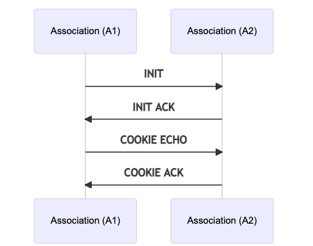

# Data Communication

## What do I get from WebRTC's data communication?

WebRTC provides data channels for data communication. Between two peers you can open 65,534 data channels.
A data channel is datagram based, and each has its own durability settings. By default, each data channel has guaranteed ordered delivery.

If you are approaching WebRTC from a media background data channels might seem wasteful. Why do I need this whole subsystem when I could just use HTTP or WebSockets?

The real power with data channels is that you can configure them to behave like UDP with unordered/lossy delivery.
This is necessary for low latency and high performance situations. You can measure the backpressure and ensure you are only sending as much as your network supports.

## How does it work?
WebRTC uses the Stream Control Transmission Protocol (SCTP), defined in [RFC 4960](https://tools.ietf.org/html/rfc4960). SCTP is a
transport layer protocol that was intended as an alternative to TCP or UDP. For WebRTC we use it as an application layer protocol which runs over our DTLS connection.

SCTP gives you streams and each stream can be configured independently. WebRTC data channels are just thin abstractions around them. The settings
around durability and ordering are just passed right into the SCTP Agent.

Data channels have some features that SCTP can't express, like channel labels. To solve that WebRTC uses the Data Channel Establishment Protocol (DCEP)
which is defined in [RFC 8832](https://tools.ietf.org/html/rfc8832). DCEP defines a message to communicate the channel label and protocol.

## DCEP
DCEP only has two messages `DATA_CHANNEL_OPEN` and `DATA_CHANNEL_ACK`. For each data channel that is opened the remote must respond with an ack.

### DATA_CHANNEL_OPEN
This message is sent by the WebRTC Agent that wishes to open a channel.

#### Packet Format
```
 0                   1                   2                   3
 0 1 2 3 4 5 6 7 8 9 0 1 2 3 4 5 6 7 8 9 0 1 2 3 4 5 6 7 8 9 0 1
+-+-+-+-+-+-+-+-+-+-+-+-+-+-+-+-+-+-+-+-+-+-+-+-+-+-+-+-+-+-+-+-+
|  Message Type |  Channel Type |            Priority           |
+-+-+-+-+-+-+-+-+-+-+-+-+-+-+-+-+-+-+-+-+-+-+-+-+-+-+-+-+-+-+-+-+
|                    Reliability Parameter                      |
+-+-+-+-+-+-+-+-+-+-+-+-+-+-+-+-+-+-+-+-+-+-+-+-+-+-+-+-+-+-+-+-+
|         Label Length          |       Protocol Length         |
+-+-+-+-+-+-+-+-+-+-+-+-+-+-+-+-+-+-+-+-+-+-+-+-+-+-+-+-+-+-+-+-+
\                                                               \
/                             Label                             /
\                                                               \
+-+-+-+-+-+-+-+-+-+-+-+-+-+-+-+-+-+-+-+-+-+-+-+-+-+-+-+-+-+-+-+-+
\                                                               \
/                            Protocol                           /
\                                                               \
+-+-+-+-+-+-+-+-+-+-+-+-+-+-+-+-+-+-+-+-+-+-+-+-+-+-+-+-+-+-+-+-+
```

#### Message Type
Message Type is a static value of `0x03`.

#### Channel Type
Channel Type controls durability/ordering attributes of the channel. It may have the following values:

* `DATA_CHANNEL_RELIABLE` (`0x00`) - No messages are lost and will arrive in order
* `DATA_CHANNEL_RELIABLE_UNORDERED` (`0x80`) - No messages are lost, but they may arrive out of order.
* `DATA_CHANNEL_PARTIAL_RELIABLE_REXMIT` (`0x01`) - Messages may be lost after trying the requested amount of times, but they will arrive in order.
* `DATA_CHANNEL_PARTIAL_RELIABLE_REXMIT_UNORDERED` (`0x81`) - Messages may be lost after trying the requested amount of times and may arrive out of order.
* `DATA_CHANNEL_PARTIAL_RELIABLE_TIMED` (`0x02`) - Messages may be lost if they don't arrive in the requested amount of time, but they will arrive in order.
* `DATA_CHANNEL_PARTIAL_RELIABLE_TIMED_UNORDERED` (`0x82`) - Messages may be lost if they don't arrive in the requested amount of time and may arrive out of order.

#### Priority
The priority of the data channel. Data channels having a higher priority will be scheduled first. Large lower-priority user messages will not delay the sending of higher-priority user messages.

#### Reliability Parameter
If the data channel type is `DATA_CHANNEL_PARTIAL_RELIABLE`, the suffixes configures the behavior:

* `REXMIT` - Defines how many times the sender will re-send the message before giving up.
* `TIMED` - Defines for how long time (in ms) the sender will re-send the message before giving up.

#### Label
A UTF-8-encoded string containing the name of the data channel. This string may be empty.

#### Protocol
If this is an empty string, the protocol is unspecified. If it is a non-empty string, it should specify a protocol registered in the "WebSocket Subprotocol Name Registry", defined in [RFC 6455](https://tools.ietf.org/html/rfc6455#page-61).

### DATA_CHANNEL_ACK
This message is sent by the WebRTC Agent to acknowledge that this data channel has been opened.

#### Packet Format
```
 0                   1                   2                   3
 0 1 2 3 4 5 6 7 8 9 0 1 2 3 4 5 6 7 8 9 0 1 2 3 4 5 6 7 8 9 0 1
+-+-+-+-+-+-+-+-+-+-+-+-+-+-+-+-+-+-+-+-+-+-+-+-+-+-+-+-+-+-+-+-+
|  Message Type |
+-+-+-+-+-+-+-+-+
```

## Stream Control Transmission Protocol
SCTP is the real power behind WebRTC data channels. It provides all these features of the data channel:

* Multiplexing
* Reliable delivery using a TCP-like retransmission mechanism
* Partial-reliability options
* Congestion Avoidance
* Flow Control

To understand SCTP we will explore it in three parts. The goal is that you will know enough to debug and learn the deep details of SCTP on your own after this chapter.

## Concepts
SCTP is a feature rich protocol. This section is only going to cover the parts of SCTP that are used by WebRTC.
Features in SCTP that are not used by WebRTC include multi-homing and path selection.

With over twenty years of development SCTP can be hard to fully grasp.

### Association
Association is the term used for an SCTP Session. It is the state that is shared
between two SCTP Agents while they communicate.

### Streams
A stream is one bi-directional sequence of user data. When you create a data channel you are actually just creating a SCTP stream. Each SCTP Association contains a list of streams. Each stream can be configured with different reliability types.

WebRTC only allows you to configure on stream creation, but SCTP actually allows changing the configuration at anytime.

### Datagram Based
SCTP frames data as datagrams and not as a byte stream. Sending and receiving data feels like using UDP instead of TCP.
You don't need to add any extra code to transfer multiple files over one stream.

SCTP messages don't have size limits like UDP. A single SCTP message can be multiple gigabytes in size.

### Chunks
The SCTP protocol is made up of chunks. There are many different types of chunks. These chunks are used for all communication.
User data, connection initialization, congestion control, and more are all done via chunks.

Each SCTP packet contains a list of chunks. So in one UDP packet you can have multiple chunks carrying messages from different streams.

### Transmission Sequence Number
The Transmission Sequence Number (TSN) is a global unique identifier for DATA chunks. A DATA chunk is what carries all the messages a user wishes to send. The TSN is important because it helps a receiver determine if packets are lost or out of order.

If the receiver notices a missing TSN, it doesn't give the data to the user until it is fulfilled.

### Stream Identifier
Each stream has a unique identifier. When you create a data channel with an explicit ID, it is actually just passed right into SCTP as the stream identifier. If you don't pass an ID the stream identifier is chosen for you.

### Payload Protocol Identifier
Each DATA chunk also has a Payload Protocol Identifier (PPID). This is used to uniquely identify what type of data is being exchanged.
SCTP has many PPIDs, but WebRTC is only using the following five:

* `WebRTC DCEP` (`50`) - DCEP messages.
* `WebRTC String` (`51`) - DataChannel string messages.
* `WebRTC Binary` (`53`) - DataChannel binary messages.
* `WebRTC String Empty` (`56`) - DataChannel string messages with 0 length.
* `WebRTC Binary Empty` (`57`) - DataChannel binary messages with 0 length.

## Protocol
The following are some of the chunks used by the SCTP protocol. This is
not an exhaustive demonstration. This provides enough structures for the
state machine to make sense.

Each Chunk starts with a `type` field. Before a list of chunks, you will
also have a header.

### DATA Chunk
```
 0                   1                   2                   3
 0 1 2 3 4 5 6 7 8 9 0 1 2 3 4 5 6 7 8 9 0 1 2 3 4 5 6 7 8 9 0 1
+-+-+-+-+-+-+-+-+-+-+-+-+-+-+-+-+-+-+-+-+-+-+-+-+-+-+-+-+-+-+-+-+
|   Type = 0    | Reserved|U|B|E|    Length                     |
+-+-+-+-+-+-+-+-+-+-+-+-+-+-+-+-+-+-+-+-+-+-+-+-+-+-+-+-+-+-+-+-+
|                              TSN                              |
+-+-+-+-+-+-+-+-+-+-+-+-+-+-+-+-+-+-+-+-+-+-+-+-+-+-+-+-+-+-+-+-+
|      Stream Identifier        |   Stream Sequence Number      |
+-+-+-+-+-+-+-+-+-+-+-+-+-+-+-+-+-+-+-+-+-+-+-+-+-+-+-+-+-+-+-+-+
|                  Payload Protocol Identifier                  |
+-+-+-+-+-+-+-+-+-+-+-+-+-+-+-+-+-+-+-+-+-+-+-+-+-+-+-+-+-+-+-+-+
\                                                               \
/                            User Data                          /
\                                                               \
+-+-+-+-+-+-+-+-+-+-+-+-+-+-+-+-+-+-+-+-+-+-+-+-+-+-+-+-+-+-+-+-+
```
The DATA chunk is how all user data is exchanged. When you send
anything over the data channel, this is how it is exchanged.

`U` bit is set if this is an unordered packet. We can ignore the
Stream Sequence Number.

`B` and `E` are the beginning and end bits. If you want to send a
message that is too large for one DATA chunk it needs to be fragmented into multiple DATA chunks sent in separate packets.
With the `B` and `E` bit and Sequence Numbers SCTP is able to express
this.

* `B=1`, `E=0` - First piece of a fragmented user message.
* `B=0`, `E=0` - Middle piece of a fragmented user message.
* `B=0`, `E=1` - Last piece of a fragmented user message.
* `B=1`, `E=1` - Unfragmented message.

`TSN` is the Transmission Sequence Number. It is the global unique
identifier for this DATA chunk. After 4,294,967,295 chunks this will wrap around to 0.
The TSN is incremented for every chunk in a fragmented user message so that the receiver knows how to order the received chunks to reconstruct the original message.

`Stream Identifier` is the unique identifier for the stream this data belongs to.

`Stream Sequence Number` is a 16-bit number incremented every user message and included in the DATA message chunk header. After 65535 messages this will wrap around to 0. This number is used to decide the message order of delivery to the receiver if `U` is set to 0. Similar to the TSN, except the Stream Sequence Number is only incremented for each message as a whole and not each individual DATA chunk.

`Payload Protocol Identifier` is the type of data that is flowing through
this stream. For WebRTC, it is going to be DCEP, String or Binary.

`User Data` is what you are sending. All data you send via a WebRTC data channel
is transmitted via a DATA chunk.

### INIT Chunk
```
 0                   1                   2                   3
 0 1 2 3 4 5 6 7 8 9 0 1 2 3 4 5 6 7 8 9 0 1 2 3 4 5 6 7 8 9 0 1
+-+-+-+-+-+-+-+-+-+-+-+-+-+-+-+-+-+-+-+-+-+-+-+-+-+-+-+-+-+-+-+-+
|   Type = 1    |  Chunk Flags  |      Chunk Length             |
+-+-+-+-+-+-+-+-+-+-+-+-+-+-+-+-+-+-+-+-+-+-+-+-+-+-+-+-+-+-+-+-+
|                         Initiate Tag                          |
+-+-+-+-+-+-+-+-+-+-+-+-+-+-+-+-+-+-+-+-+-+-+-+-+-+-+-+-+-+-+-+-+
|           Advertised Receiver Window Credit (a_rwnd)          |
+-+-+-+-+-+-+-+-+-+-+-+-+-+-+-+-+-+-+-+-+-+-+-+-+-+-+-+-+-+-+-+-+
|  Number of Outbound Streams   |  Number of Inbound Streams    |
+-+-+-+-+-+-+-+-+-+-+-+-+-+-+-+-+-+-+-+-+-+-+-+-+-+-+-+-+-+-+-+-+
|                          Initial TSN                          |
+-+-+-+-+-+-+-+-+-+-+-+-+-+-+-+-+-+-+-+-+-+-+-+-+-+-+-+-+-+-+-+-+
\                                                               \
/              Optional/Variable-Length Parameters              /
\                                                               \
+-+-+-+-+-+-+-+-+-+-+-+-+-+-+-+-+-+-+-+-+-+-+-+-+-+-+-+-+-+-+-+-+
```

The INIT chunk starts the process of creating an association.

`Initiate Tag` is used for cookie generation. Cookies are used for Man-In-The-Middle
and Denial of Service protection. They are described in greater detail in the state
machine section.

`Advertised Receiver Window Credit` is used for SCTP's Congestion Control. This
communicates how large of a buffer the receiver has allocated for this association.

`Number of Outbound/Inbound Streams` notifies the remote of how many streams this
agent supports.

`Initial TSN` is a random `uint32` to start the local TSN at.

`Optional Parameters` allows SCTP to introduce new features to the protocol.


### SACK Chunk

```
 0                   1                   2                   3
 0 1 2 3 4 5 6 7 8 9 0 1 2 3 4 5 6 7 8 9 0 1 2 3 4 5 6 7 8 9 0 1
+-+-+-+-+-+-+-+-+-+-+-+-+-+-+-+-+-+-+-+-+-+-+-+-+-+-+-+-+-+-+-+-+
|   Type = 3    |Chunk  Flags   |      Chunk Length             |
+-+-+-+-+-+-+-+-+-+-+-+-+-+-+-+-+-+-+-+-+-+-+-+-+-+-+-+-+-+-+-+-+
|                      Cumulative TSN Ack                       |
+-+-+-+-+-+-+-+-+-+-+-+-+-+-+-+-+-+-+-+-+-+-+-+-+-+-+-+-+-+-+-+-+
|          Advertised Receiver Window Credit (a_rwnd)           |
+-+-+-+-+-+-+-+-+-+-+-+-+-+-+-+-+-+-+-+-+-+-+-+-+-+-+-+-+-+-+-+-+
| Number of Gap Ack Blocks = N  |  Number of Duplicate TSNs = X |
+-+-+-+-+-+-+-+-+-+-+-+-+-+-+-+-+-+-+-+-+-+-+-+-+-+-+-+-+-+-+-+-+
|  Gap Ack Block #1 Start       |   Gap Ack Block #1 End        |
+-+-+-+-+-+-+-+-+-+-+-+-+-+-+-+-+-+-+-+-+-+-+-+-+-+-+-+-+-+-+-+-+
/                                                               /
\                              ...                              \
/                                                               /
+-+-+-+-+-+-+-+-+-+-+-+-+-+-+-+-+-+-+-+-+-+-+-+-+-+-+-+-+-+-+-+-+
|   Gap Ack Block #N Start      |  Gap Ack Block #N End         |
+-+-+-+-+-+-+-+-+-+-+-+-+-+-+-+-+-+-+-+-+-+-+-+-+-+-+-+-+-+-+-+-+
|                       Duplicate TSN 1                         |
+-+-+-+-+-+-+-+-+-+-+-+-+-+-+-+-+-+-+-+-+-+-+-+-+-+-+-+-+-+-+-+-+
/                                                               /
\                              ...                              \
/                                                               /
+-+-+-+-+-+-+-+-+-+-+-+-+-+-+-+-+-+-+-+-+-+-+-+-+-+-+-+-+-+-+-+-+
|                       Duplicate TSN X                         |
+-+-+-+-+-+-+-+-+-+-+-+-+-+-+-+-+-+-+-+-+-+-+-+-+-+-+-+-+-+-+-+-+
```

The SACK (Selective Acknowledgment) Chunk is how a receiver notifies
a sender it has gotten a packet. Until a sender gets a SACK for a TSN
it will re-send the DATA chunk in question. A SACK does more than just
update the TSN though.

`Cumulative TSN ACK` the highest TSN that has been received.

`Advertised Receiver Window Credit` receiver buffer size. The receiver
may change this during the session if more memory becomes available.

`Ack Blocks` TSNs that have been received after the `Cumulative TSN ACK`.
This is used if there is a gap in packets delivered. Let's say DATA chunks with TSNs
`100`, `102`, `103` and `104` are delivered. The `Cumulative TSN ACK` would be `100`, but
`Ack Blocks` could be used to tell the sender it doesn't need to resend `102`, `103` or `104`.

`Duplicate TSN` informs the sender that it has received the following DATA chunks more than once.

### HEARTBEAT Chunk
```
 0                   1                   2                   3
 0 1 2 3 4 5 6 7 8 9 0 1 2 3 4 5 6 7 8 9 0 1 2 3 4 5 6 7 8 9 0 1
+-+-+-+-+-+-+-+-+-+-+-+-+-+-+-+-+-+-+-+-+-+-+-+-+-+-+-+-+-+-+-+-+
|   Type = 4    | Chunk  Flags  |      Heartbeat Length         |
+-+-+-+-+-+-+-+-+-+-+-+-+-+-+-+-+-+-+-+-+-+-+-+-+-+-+-+-+-+-+-+-+
\                                                               \
/            Heartbeat Information TLV (Variable-Length)        /
\                                                               \
+-+-+-+-+-+-+-+-+-+-+-+-+-+-+-+-+-+-+-+-+-+-+-+-+-+-+-+-+-+-+-+-+
```

The HEARTBEAT Chunk is used to assert the remote is still responding.
Useful if you aren't sending any DATA chunks and need to keep a NAT
mapping open.

### ABORT Chunk
```
 0                   1                   2                   3
 0 1 2 3 4 5 6 7 8 9 0 1 2 3 4 5 6 7 8 9 0 1 2 3 4 5 6 7 8 9 0 1
+-+-+-+-+-+-+-+-+-+-+-+-+-+-+-+-+-+-+-+-+-+-+-+-+-+-+-+-+-+-+-+-+
|   Type = 6    |Reserved     |T|           Length              |
+-+-+-+-+-+-+-+-+-+-+-+-+-+-+-+-+-+-+-+-+-+-+-+-+-+-+-+-+-+-+-+-+
/                                                               /
\               Zero or more Error Causes                       \
/                                                               /
+-+-+-+-+-+-+-+-+-+-+-+-+-+-+-+-+-+-+-+-+-+-+-+-+-+-+-+-+-+-+-+-+
```

An ABORT chunk abruptly shuts down the association. Used when
one side enters an error state. Gracefully ending the connection uses
the SHUTDOWN chunk.

### SHUTDOWN Chunk
```
 0                   1                   2                   3
 0 1 2 3 4 5 6 7 8 9 0 1 2 3 4 5 6 7 8 9 0 1 2 3 4 5 6 7 8 9 0 1
+-+-+-+-+-+-+-+-+-+-+-+-+-+-+-+-+-+-+-+-+-+-+-+-+-+-+-+-+-+-+-+-+
|   Type = 7    | Chunk  Flags  |      Length = 8               |
+-+-+-+-+-+-+-+-+-+-+-+-+-+-+-+-+-+-+-+-+-+-+-+-+-+-+-+-+-+-+-+-+
|                      Cumulative TSN Ack                       |
+-+-+-+-+-+-+-+-+-+-+-+-+-+-+-+-+-+-+-+-+-+-+-+-+-+-+-+-+-+-+-+-+
```

The SHUTDOWN Chunk starts a graceful shutdown of the SCTP association.
Each agent informs the remote of the last TSN it sent. This ensures
that no packets are lost. WebRTC doesn't do a graceful shutdown of
the SCTP association. You need to tear down each data channel yourself
to handle it gracefully.

`Cumulative TSN ACK` is the last TSN that was sent. Each side knows
not to terminate until they have received the DATA chunk with this TSN.

### ERROR Chunk
```
 0                   1                   2                   3
 0 1 2 3 4 5 6 7 8 9 0 1 2 3 4 5 6 7 8 9 0 1 2 3 4 5 6 7 8 9 0 1
+-+-+-+-+-+-+-+-+-+-+-+-+-+-+-+-+-+-+-+-+-+-+-+-+-+-+-+-+-+-+-+-+
|   Type = 9    | Chunk  Flags  |           Length              |
+-+-+-+-+-+-+-+-+-+-+-+-+-+-+-+-+-+-+-+-+-+-+-+-+-+-+-+-+-+-+-+-+
\                                                               \
/                    One or more Error Causes                   /
\                                                               \
+-+-+-+-+-+-+-+-+-+-+-+-+-+-+-+-+-+-+-+-+-+-+-+-+-+-+-+-+-+-+-+-+
```

An ERROR chunk is used to notify the remote SCTP Agent that a non-fatal
error has occurred.

### FORWARD TSN Chunk
```
 0                   1                   2                   3
 0 1 2 3 4 5 6 7 8 9 0 1 2 3 4 5 6 7 8 9 0 1 2 3 4 5 6 7 8 9 0 1
+-+-+-+-+-+-+-+-+-+-+-+-+-+-+-+-+-+-+-+-+-+-+-+-+-+-+-+-+-+-+-+-+
|   Type = 192  |  Flags = 0x00 |        Length = Variable      |
+-+-+-+-+-+-+-+-+-+-+-+-+-+-+-+-+-+-+-+-+-+-+-+-+-+-+-+-+-+-+-+-+
|                      New Cumulative TSN                       |
+-+-+-+-+-+-+-+-+-+-+-+-+-+-+-+-+-+-+-+-+-+-+-+-+-+-+-+-+-+-+-+-+
|         Stream-1              |       Stream Sequence-1       |
+-+-+-+-+-+-+-+-+-+-+-+-+-+-+-+-+-+-+-+-+-+-+-+-+-+-+-+-+-+-+-+-+
\                                                               /
/                                                               \
+-+-+-+-+-+-+-+-+-+-+-+-+-+-+-+-+-+-+-+-+-+-+-+-+-+-+-+-+-+-+-+-+
|         Stream-N              |       Stream Sequence-N       |
+-+-+-+-+-+-+-+-+-+-+-+-+-+-+-+-+-+-+-+-+-+-+-+-+-+-+-+-+-+-+-+-+
```

The `FORWARD TSN` chunk moves the global TSN forward. SCTP does this, 
so you can skip some packets you don't care about anymore. Let's say
you send `10 11 12 13 14 15` and these packets are only valid if they
all arrive. This data is also real-time sensitive, so if it arrives
late it isn't useful.

If you lose `12` and `13` there is no reason to send `14` and `15`!
SCTP uses the `FORWARD TSN` chunk to achieve that. It tells the receiver
that `14` and `15` aren't going to be delivered anymore.

`New Cumulative TSN` this is the new TSN of the connection. Any packets
before this TSN will not be retained.

`Stream` and `Stream Sequence` are used to jump the `Stream Sequence Number`
number ahead. Refer back to the DATA Chunk for the significance of this field.

## State Machine
These are some interesting parts of the SCTP state machine. WebRTC doesn't use all
the features of the SCTP state machine, so we have excluded those parts. We also have simplified some components to make them understandable on their own.

### Connection Establishment Flow
The `INIT` and `INIT ACK` chunks are used to exchange the capabilities and configurations
of each peer. SCTP uses a cookie during the handshake to validate the peer it is communicating with.
This is to ensure that the handshake is not intercepted and to prevent DoS attacks.

The `INIT ACK` chunk contains the cookie. The cookie is then returned to its creator
using the `COOKIE ECHO`. If cookie verification is successful the `COOKIE ACK` is
sent and DATA chunks are ready to be exchanged.



### Connection Teardown Flow
SCTP uses the `SHUTDOWN` chunk. When an agent receives a `SHUTDOWN` chunk it will wait until it
receives the requested `Cumulative TSN ACK`. This allows a user to ensure that all data
is delivered even if the connection is lossy.

### Keep-Alive Mechanism
SCTP uses the `HEARTBEAT REQUEST` and `HEARTBEAT ACK` Chunks to keep the connection alive. These are sent
on a configurable interval. SCTP also performs an exponential backoff if the packet hasn't arrived.

The `HEARTBEAT` chunk also contains a time value. This allows two associations to compute trip time between two agents.
