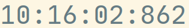
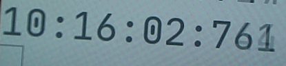
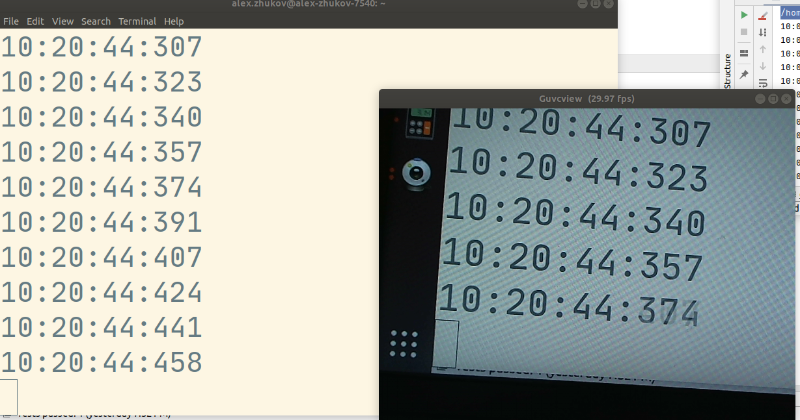
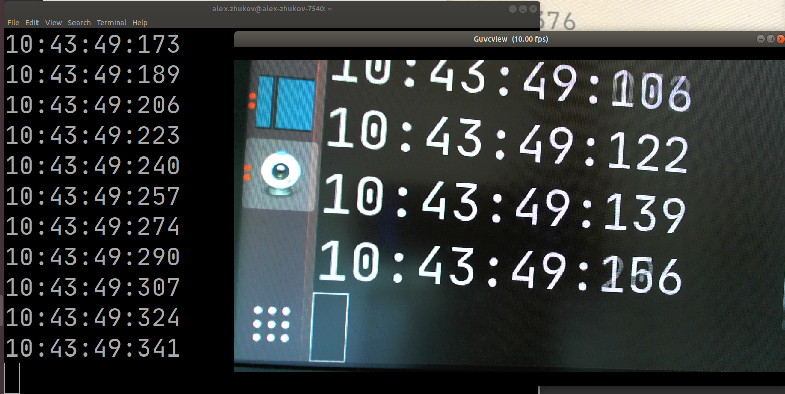

# Latency

## Definition 

L = Δt = t`Observe` - t`Happen`

Latency is the time between an event actually happening and its observation. More specifically for video, latency is the time between an event happening to the receipt of a complete, understood frame displayed on a screen of a receiver.
For example: the sender points a web camera to a wall clock ticking, captures the clock to video frames, encodes them and transmits  video data over cellular and the receiver receives it over wired connection, decodes and displays on screen.

By this definition, the time from the hand ticking on the clock to it being displayed on receivers's monitor is end-to-end video latency.

The time from the transmission of a frame to reception of that frame is the sender-to-receiver time.

## Why is it important?
On one hand the purpose of live video stream can be just informing of the current state of the world while no decisions are being made based on the information received. On the other hand ultra low latency live video streams can be used to remotely control a device where presence of a human being is either impossible or cost prohibitive. 
Importance of keeping end-to-end latency to a minimum increases with the cost of a mistake of an untimely decision based on out of date information.

For example a weather station’s camera live streaming current weather conditions may be delayed by minutes whereas a remote controlled flying drone or a vehicle may not be safely operated at latencies above 500 milliseconds. In the later case the difference between low and  high latency may literally be life or death defining. 
Both extreme cases are here to demonstrate the spectrum of importance, however the most common case for live media now are web conferencing where high latency is rarely life threatening. However delayed video and/or audio creates impedance to productive conversation which is often uncomfortable enough to prevent people from using the internet as means for communication. Which in times of global pandemic (2020) may mean lost opportunities and revenues.

Thus measuring latency and providing real-time feedback to the remote operator may affect their decision, similarly we should also consider limiting the operator input affecting safety critical or otherwise high value decisions to a level where there is no human input as a human could not detect or deal with significantly delayed signal.

## How do you measure latency?

True latency is supposed to be measured end-to-end. That is, not just the latency of the network path between sender and receiver, but the latency combined latency of camera capture, frame encoding, transmission, receipt, decoding and display as well as  possible queueing between any of the steps. 

One way to measure end-to-end latency is when sender and receiver are in the same frame of reference.  

### Experiment 1 - Camera and end-to-end latency
```
    Happen      Camera      Observe
----+-----------+-----------+---------->
               (time)
```

Tools: 
- ticking millisecond clock app
- 60hz screen = 60 new clocks shown per second
- simple usb webcam
- camera settings app

Instruments:
- iphone 8 slomo
- screenshot tool


 -  == 101msec


| 84msec                      |           185msec            |
| --------------------------- | :--------------------------: |
|  |  |

Conclusion: changing camera intrinsic settings like auto exposure and content of image being shot affects latency in 84-185 msec range

### Experiment 2 - WebRTC on same wifi
[TODO]
Conclusion: Adding encode and transmission steps jumps latency to about 300 msec. Measuring approach works in the multihost case. 

### Experiment 3 - WebRTC over LTE
[TODO]
I am going to call myself, but my laptop is going through an LTE hotspot on my phone.

Adding encode and transmission over LTE increases latency to 400-700 msec. Changing network conditions are captured by the measurement. 

I have demonstrated my approach to measuring latency. The main trick is to put both Event and its Observer in the same frame of reference and field of view. 
The upside of the approach is that it provides the most real-world “what you see is what you get” measurement, experiments are easy to conduct and results are obvious to audiences without specialized knowledge. It does not rely on expensive and unreliable time synchronization or any kind of time awareness on either sender or receiver. 

The approach has one HUGE drawback however - it is manual as well as it requires both sender and receiver to be located in the same place.
Let’s discuss automation ideas as next steps.

## Latency measurement automation
While one could theoretically measure latency of each component of a live video transmission pipeline separately and then sum all latencies in practice at least some components are either inaccessible for instrumentation or produce significantly different results when measured outside of such pipeline. Variable queue depths between pipeline stages, network topology and  camera exposure changes are just a few examples of components affecting end-to-end latency. 

## Good enough automatic latency measurement

If/when you can trade off some imprecision of latency measurements for automation you may use a method inspired by networking protocol for clock synchronization between computer systems over packet-switched, variable-latency data networks - the Network Time Protocol (NTP).

### Latency measurement with WebRTC built-in stats
[TODO: chrome does not implement all necessary WebRTC stats yet, refer to next chapter for the workaround method, Talk about sender reports, NTP and RTP timestamps, how they are supposed to be exposed in WebRTC apis being discussed]

### Latency measurement with NTP inspired time synchronization
```
      tSV      tS                       tR
       |       |                        |
       |       |             <--(tR1)-- + [tR1]
       |       | <-----------           |
[tSV1] + [tS1] +                        |
       |       | ---->                  |
       |       |     --(tR1,tS1,tSV1)-> + [tR2]
       |       |                        |

RTT = tR2 - tR1
sender_local_clock_at_tR2 = tS1 + RTT / 2
```

Given a communication channel between sender and receiver (eg [DataChannel](https://webrtc.org/getting-started/data-channels)) receiver may create a model of the sender’ monotonic clock by following the below protocol.
1. At time `tR1` receiver sends a message its local monotonic clock timestamp. 
2. When received at sender local time `tS1` the sender responds with a copy of `tR1` as well as sender’s `tS1` and
 sender’s video track time `tSV1`. 
3. At time `tR2` on receiving end round trip time is calculated by subtracting the message’s  send and receive times. `RTT = tR2 - tR1`
4. Round trip time `RTT` together with sender local timestamp `tS1` is enough to create an estimation of sender's monotonic clock. Current time on sender at time `tR2` would be equal to `tS1` plus half of round trip time.  
5. Sender's local clock timestamp `tS1` paired with video track timestamp `tSV1` together with round trip time `RTT` is therefore enough to sync receiver video track time to sender video track. 

Now that we know how much time has passed since last known sender video frame time `tSV1` we can approximate latency by comparing currently displayed video frame's time less time elapsed since `tSV1`.

```
expected_video_time = tSV1 + time_since(tSV1)
latency = expected_video_time - actual_video_time
```

#### Actual video time in browser

> `<video>.requestVideoFrameCallback()` allows web authors to be notified when a frame has been presented for composition.

Until very recently (May 2020) it was next to impossible to reliably get a timestamp of currently displayed video frame in browsers, workaround methods based on `video.currentTime` existed but were not particularly precise. Browser developers both Chrome and Mozilla [supported](https://github.com/mozilla/standards-positions/issues/250) introduction of a new w3c standard [`HTMLVideoElement.requestVideoFrameCallback()`](https://wicg.github.io/video-rvfc/) which enables API for current video frame time access. 
While the addition sounds trivial it has enabled multiple advanced media applications on the web, which require audio/video synchronization.

[TODO: more on time in browser]

#### Example latency estimation

On receiving end

Open data channel
```javascript
send_channel = peer_connection.createDataChannel('latency', null);
```

Send receivers time `tR1` periodically, this example uses 2 seconds for no particular reason
```javascript
setInterval(() => {
       let tR1 = Math.trunc(performance.now());
       send_channel.send("" + tR1);
}, 2000);
```

Handle incoming message from sender, print estimated latency to `console`
```javascript

//assuming event.data is a json string like: 
// {
//   "received_time": 64714,
//   "delay_since_received": 46,
//   "local_clock": 1597366470336,
//   "track_times_msec": {
//     "myvideo_track1": [
//       13100,
//       1597366470289
//     ]
//   }
// }
let tR2 = performance.now();
let sender_report = JSON.parse(event.data);
let tR1 = sender_report['received_time'];
let delay = sender_report['delay_since_received']; //how much time passed between sender receiving and sending the response
let rtt = tR2 - delay - tR1;

VIDEO.requestVideoFrameCallback((now_, framemeta) => {
       let sender_time = (sender_report['local_clock'] + delay + rtt / 2 + (now_ - tR2));
       let [tSV1, tS1] = Object.entries(sender_report.track_times_msec)[0][1]
       let time_since_last_known_frame = sender_time - tS1;
       let expected_video_time = tSV1 + time_since_last_known_frame;
       let actual_video_time = Math.trunc(framemeta.rtpTimestamp / 90); //90 is hardcoded video timebase of 90000
       let latency = expected_video_time - actual_video_time;
       console.log('latency', latency,'msec');
});
```

On sender

Handle incoming message from receiver
```javascript
//assuming event.data is a string like: "1234567"
tR1 = event.data
now = Math.trunc(performance.now());
tSV1 = 42000;
tS1 = 1597366470289;

msg = {
  "received_time": tR1,
  "delay_since_received": 0,
  "local_clock": now,
  "track_times_msec": {
    "myvideo_track1": [tSV1, tS1]
  }
}
send_channel.send(JSON.stringify(msg));
```
